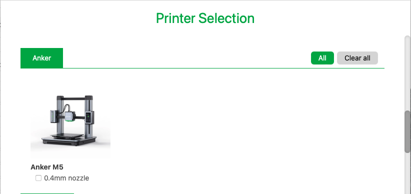
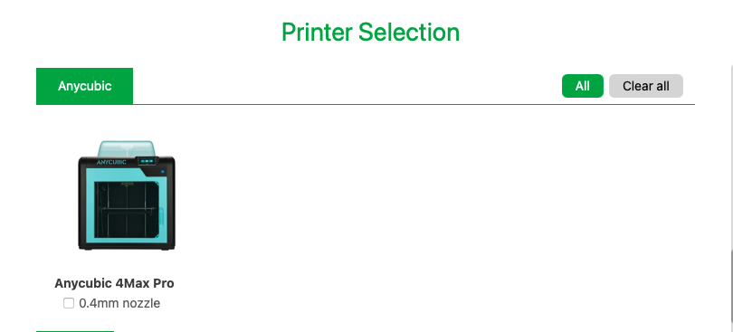
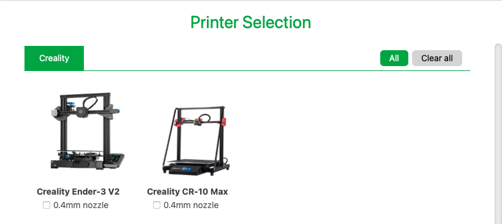
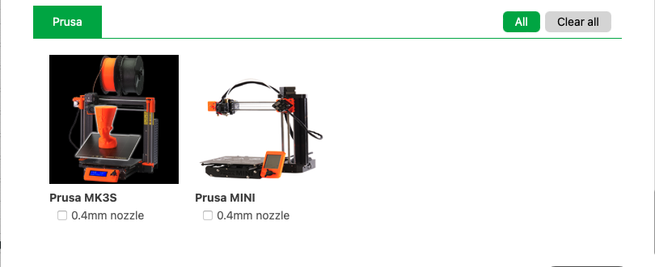
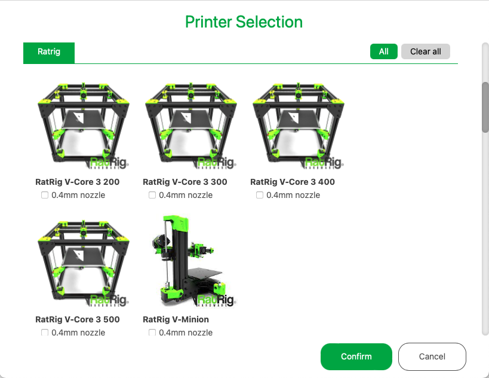
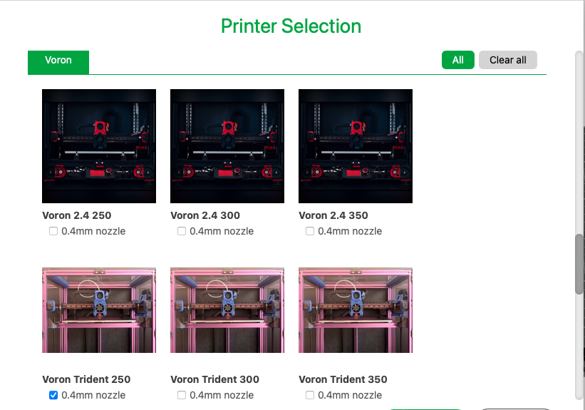
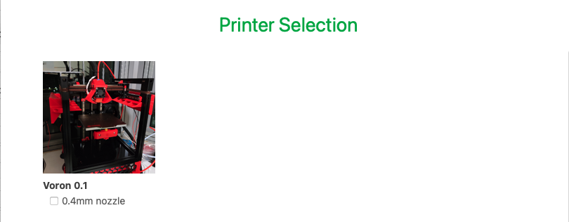

# Orca Slicer - SoftFever
A modified version of Orca Slicer with many handy features.   
It's fully compatible with Bambulab X1/X1-C/P1P printers.
It also supports Anycubic, Anker, Creality, Prusa MK3S, RatRig and Voron printers.  
You can download it here: https://github.com/SoftFever/OrcaSlicer/releases

## OrcaSlicer SoftFever change notes:

### [V1.4.2 changes](https://github.com/SoftFever/OrcaSlicer/releases/tag/v1.4.2):
- Change the color theme :)
- Fixed a crash issue when selecting vase mode on some machines
- Port firmware retraction and Extra length on restart retraction feature from PrusaSlicer
- Fine-tune calibration features
   1. Enforce max volumetric speed in PA line mode
   2. Ensure print speeds are consistent across all blocks in the flow-rate calibration process. This is to help users calibrate those challenging filaments(such as TPU) by minimizing the influence of printing speed - thanks @psiberfunk for his input on this
- New printer models: thanks @erebus04 and @GP3D84
   1. Tronxy X5SA 400
   2. Artillery Sidewinder
- QoL:
   1. Now allow exporting g-code for BBL printers
   2. Fixed a bug that printer connection info was removed after loading a 3mf project
fixed an issue that user presets were not loaded when Auto sync user preset option was off in Preference.
   3.Germany language translation - thanks @hliebscher
- Misc fixes:
   1. Exit calibration mode when a new model is added to the scene(creating a new project after calibration is recommended)
   2. Skip emitting M106 P2 command if the auxiliary fan is not enabled.
   3. Fix an issue that previously there was a z-fighting issue when bed models are used for 3rd party printers
   4. Fixed an issue that max volumetric speed was not correctly calculated if flow-rate was changed per object.
   5. CICD for Linux build - thanks @fang64
Known issues:

The Calibration menu is missing on some Mac machines. Try restarting the App can usually fix it. See [#120](https://github.com/SoftFever/OrcaSlicer/issues/120)

### [V1.4.1 changes](https://github.com/SoftFever/OrcaSlicer/releases/tag/v1.4.1):
- Added a feature for checking and displaying a notification for a new version
- Added RatRig printer profiles, thanks @erebus04 for working this
- Added support for the Creality CR-10 Max and Anker M5 printers.
- Fixed the issue with profile cloud syncing for third-party printers.
- set inner_wall_acceleration to 5000 for Bambu printers
- Added support for the first_layer_bed_temperature and first_layer_temperature variables for better compatibility."
- Fixed a crashing bug when adding text Mac Intel machine
- QoL improvements for naming logic:
   1. The filename format is now supported when exporting 3mf files.
   2. If the project is not defined, the model name will be used as the output name.
   3. The "Untitled" string will no longer be added if the project name is set.
   4. The "_plate_0" string has been removed from the file name if there is only one plate.

<details>
  <summary> 👉 "Click here" for OLD Release Note</summary>   
  
### [V1.4.0 changes](https://github.com/SoftFever/OrcaSlicer/releases/tag/v1.4.0):
- Add Layer Time/Layer time(Log) display (NOTE: need more tweaking work for BBL printers as the layer time is skewed by the preparing time)
- Add `sandwich`(inner-outer-inner-infill) mode support for Arachne engine.
- Change default `wall loop` from 2 to 3
- Fix an issue that the last used printer was not remembered after application restart. (Thanks Bambulab engineers, for the quick response and fixing)
- Optimized layer height sanity check logic. It will check against `max_layer_height` in the printer settings now. (I can use CHT 1.8 nozzle to print 1.0 mm thick layers now ;) )
- Add Prusa MINI+ profile
- expose `bed_exclude_area` parameter to 3rd printers
- Fix some 3rd party printer related issues introduced in [BambuStudio v01.04.00.17](https://github.com/bambulab/BambuStudio/releases/tag/v01.04.00.17)
   1.  Can't send sliced files to printers
   2.  AMS filaments were added to non-Bambulab printers
   3. Wrong bed setting was applied
  
### [V1.3.4 changes](https://github.com/SoftFever/OrcaSlicer/releases/tag/v1.3.4):
1. Add a new printer order - sandwich mode:
This new order is similar to the outer-wall-first mode in achieving the best dimensional accuracy. This new approach however avoids printing outer walls right after a long travel, which may cause artifacts on the surface in many cases.
sandwich-mode1
sandwich-mode2
2. Support RRF firmware(experimental)
3. Fix a compatibility issue for gcode-preview
4. Merge upstream changes

### [V1.3.3 changes](https://github.com/SoftFever/OrcaSlicer/releases/tag/v1.3.3):
1. Improve top surface quality. 
	Fix a bug that internal solid infills didn't use monotonic when top surface is using monotonic lines
2. New feature: filter out tiny gaps.
	Note: for aesthetic considerations, this setting won't affect top/bottom layers. In other words, gap fills that can be seen from outside won't be filtered out
3. PA(pressure advance) now support multi-color printing. A new PA value from the selected filament profile will be applied whenever there is 
a filament/extruder change action. This change only affects multi-color printing.
5. Users can now set float values of layer time in Filament->Cooling tab. 
6. Allow to set target bed temp to 0
7. Fix a bug that layer number is not displayed correctly in klipper UIs
8. Force using linear PA model when manual PA override is enabled for Bambu machines
9. Remember the last used filament
10. Skip checking BL network plugin for third-party printers.
### [V1.3.2 changes](https://github.com/SoftFever/OrcaSlicer/releases/tag/v1.3.2-sf):
1. Support device control view for 3rd party printers
2. Port `Small perimeters` feature from PrusaSlicer. I also add an extra option to adjust the small perimeter threshold
You might want to reduce speed for small perimeter parts to prevent failures like bellow:
3. Add fan speed preview mode
4. Fix an issue that print time estimation is inaccurate when `Klipper` g-code style is used.
### [V1.3.1 changes](https://github.com/SoftFever/OrcaSlicer/releases/tag/v1.3.1-sf):
1. Support change bed size and nozzle diameter
2. Allow users to specify the bridge infill direction
3. bridge_infill_direction1
4. bridge_infill_direction2
5. Change to ISO view angle for preview image
6. Add an option to change Z Hop action: NormalLift/SpiralLift
7. Optimise g-code generation for both Bambu printers and 3rd party printers
8. Support Klipper Exclude Objects
9. Better support for Moonraker's metadata.

### [V1.2.5.3 changes](https://github.com/SoftFever/OrcaSlicer/releases/tag/v1.2.5.3-sf):
1. Label objects to support Klipper Exclude Objects feature
2. Allow users to change output file name format
3. Fix a bug that pressure advance value was not saved in the profile
4. Optimize non-Bambu printer profiles
5. Remove M900 S0 which is not necessary.

### [V1.2.5 changes](https://github.com/SoftFever/OrcaSlicer/releases/tag/v1.2.5-sf):
1. Add options to adjust jerk for different line types
2. Add an option to adjust acceleration for travel. Higher acceleration for travel and lower acceleration for the outer wall makes it possible to print faster and nicer.
3. Add an option to manually override the Pressure Advance / Linear Advance for each filament.

### [V1.2.4 changes](https://github.com/SoftFever/OrcaSlicer/releases/tag/v1.2.4-sf):
1. Allow users to adjust accelerations for inner/outer walls separately.
2. Allow users to adjust the bottom surface flow-rate
3. Fix an issue that bed temperature for other layers is not set properly. This bug exists in the upstream as well. My PR here(bambulab#319)

### [V1.2 changes](https://github.com/SoftFever/OrcaSlicer/releases/tag/v1.2-sf):
1. Allow user to change machine limits
2. Allow users to adjust the top surface flow-rate.
3. Unlock some cool hidden features in BambuStudio.
4. Fix an issue that the software connected to Bambulab's staging server by default. (Only Bambulab machines were affected)

### [V1.1 changes](https://github.com/SoftFever/OrcaSlicer/releases/tag/v1.1):
1. Support third-party printers:
   - Voron 2.4
   - Voron Trident
   - Voron 0.1
   - Prusa MK3S
2. Export to to .gcode file.
3. Send gcode file to printer
4. Support single wall mode on first layer
5. Support Chamber temperature. This setting can be use in machine start G-Gcode
6. Support thumbview for third-party printers
</details>

Demo video: https://youtu.be/vSNE9iGj2II  
 
## NOTE: 
## 1. For Apple M1 users, please take a look at this [article](https://www.howtogeek.com/803598/app-is-damaged-and-cant-be-opened/ ) about how to run unsigned applications on your machine. Or better, you can build it from the source codes if you want:) 
  Apple requires a subscription(costs 99$ yearly) for developers to sign their app. I don't do a lot of dev work on Mac, and this is a nonprofit open-source project, so I decided not to pay the money ;)   

## 2. If you have troubles to run the build, you might need to install following runtimes:  
- [MicrosoftEdgeWebView2RuntimeInstallerX64](https://github.com/SoftFever/OrcaSlicer/releases/download/v1.0.10-sf2/MicrosoftEdgeWebView2RuntimeInstallerX64.exe)  
- [vcredist2019_x64](https://github.com/SoftFever/OrcaSlicer/releases/download/v1.0.10-sf2/vcredist2019_x64.exe)  

## 3. OrcaSlicer use G2/G3 commands by default. You need to turn on ARC support in your printer's firmware use with this slicer.
- For Voron and any Klipper based printers:  
You can enable gcode_arcs(G2/G3) support by adding following section into you printer.cfg file:  
```
[gcode_arcs]
resolution: 0.1

[gcode_macro m201]
gcode:
  
    
      SET_VELOCITY_LIMIT ACCEL={accel} ACCEL_TO_DECEL={accel * 0.5}
  
    SET_VELOCITY_LIMIT
  

[gcode_macro m203]
gcode:
  
    
    SET_VELOCITY_LIMIT VELOCITY={speed}
  
    SET_VELOCITY_LIMIT
  

[gcode_macro M205]
gcode:
  
    
    SET_VELOCITY_LIMIT SQUARE_CORNER_VELOCITY={corner_speed}
  
    SET_VELOCITY_LIMIT
  

[gcode_macro M900]
gcode:
      SET_PRESSURE_ADVANCE ADVANCE={params.K}

```

~~ It's also recommended to add followinging dummy macros to make Klipper happy ~~
Update: latest Klipper has supported G17 command. Don't add following macro if you are running on latest Klipper.
```
# Make OrcaSlicer happy
[gcode_macro G17]
gcode:

```

- For Prusa MK3S:  
ARC movement are supported by default.


# Gallery

  
  
  
  
  
  
  
 


Image credits: 
 1. Voron 2.4 and Trident: vorondesign.com
 3. Voron 0.1: myself
 4. Prusa MK3S: Prusa3d  


=========================SPLIT=========================     


# BambuStudio
Orca Slicer is a cutting-edge, feature-rich slicing software.  
It contains project-based workflows, systematically optimized slicing algorithms, and an easy-to-use graphic interface, bringing users an incredibly smooth printing experience.

Prebuilt Windows, macOS 64-bit releases are available through the [github releases page](https://github.com/bambulab/BambuStudio/releases/).  
Linux version currently is not supported.

Orca Slicer is based on [PrusaSlicer](https://github.com/prusa3d/PrusaSlicer) by Prusa Research, which is from [Slic3r](https://github.com/Slic3r/Slic3r) by Alessandro Ranellucci and the RepRap community.

See the [wiki](https://github.com/bambulab/BambuStudio/wiki) and the [documentation directory](https://github.com/bambulab/BambuStudio/tree/master/doc) for more informations.

# What are Orca Slicer's main features?
Key features are:
- Basic slicing features & GCode viewer
- Multiple plates management
- Remote control & monitoring
- Auto-arrange objects
- Auto-orient objects
- Hybrid/Tree/Normal support types, Customized support
- multi-material printing and rich painting tools
- multi-platform (Win/Mac/Linux) support
- Global/Object/Part level slicing parameters

Other major features are:
- Advanced cooling logic controlling fan speed and dynamic print speed
- Auto brim according to mechanical analysis
- Support arc path(G2/G3)
- Support STEP format
- Assembly & explosion view
- Flushing transition-filament into infill/object during filament change

# How to compile
Following platforms are currently supported to compile:
- Windows 64-bit, [Compile Guide](https://github.com/bambulab/BambuStudio/wiki/Windows-Compile-Guide)
- Mac 64-bit, [Compile Guide](https://github.com/bambulab/BambuStudio/wiki/Mac-Compile-Guide)

# Report issue
You can add an issue to the [github tracker](https://github.com/bambulab/BambuStudio/issues) if **it isn't already present.**

# License
Orca Slicer is licensed under the GNU Affero General Public License, version 3. Orca Slicer is based on PrusaSlicer by PrusaResearch.

PrusaSlicer is licensed under the GNU Affero General Public License, version 3. PrusaSlicer is owned by Prusa Research. PrusaSlicer is originally based on Slic3r by Alessandro Ranellucci.

Slic3r is licensed under the GNU Affero General Public License, version 3. Slic3r was created by Alessandro Ranellucci with the help of many other contributors.

The GNU Affero General Public License, version 3 ensures that if you use any part of this software in any way (even behind a web server), your software must be released under the same license.

The bambu networking plugin is based on non-free libraries. It is optional to the Orca Slicer and provides extended functionalities for users.

