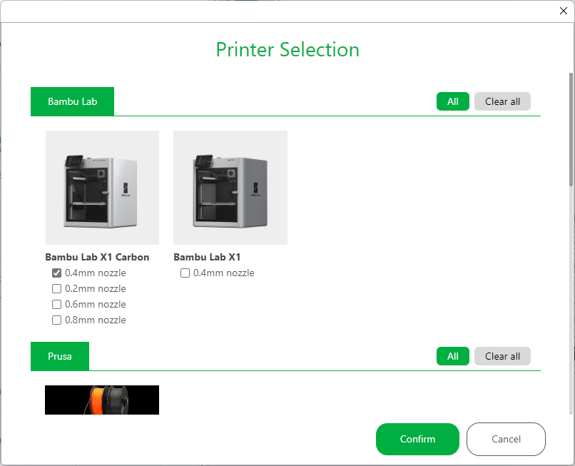
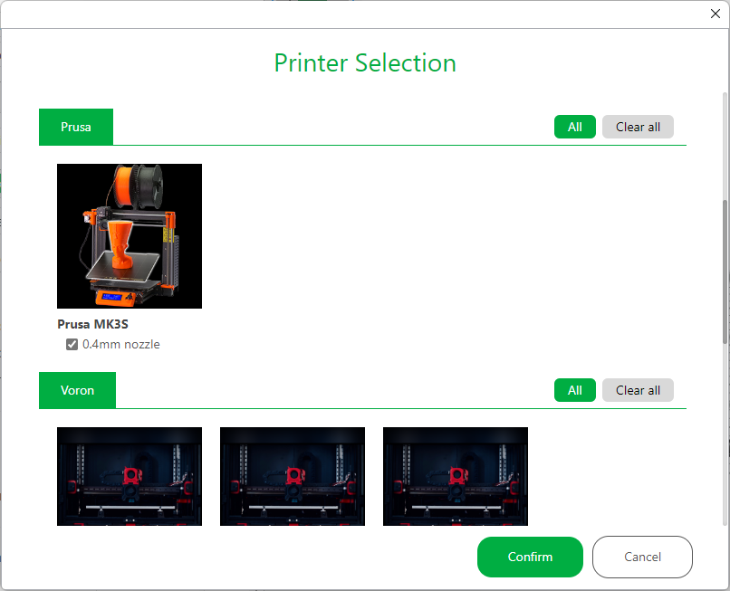
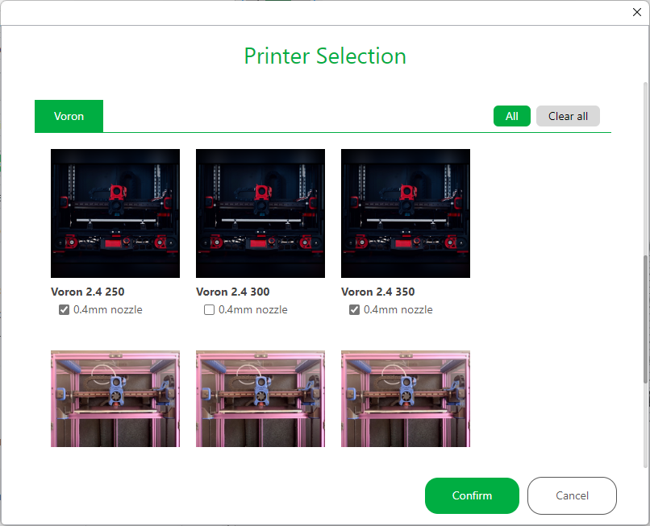
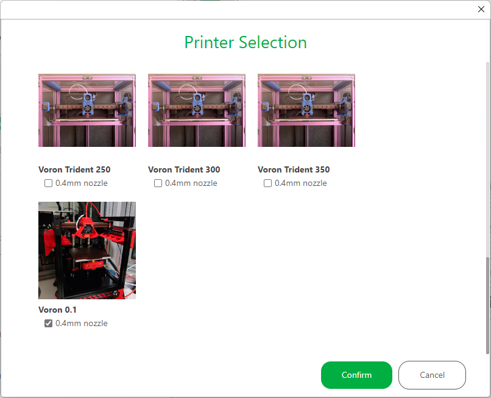
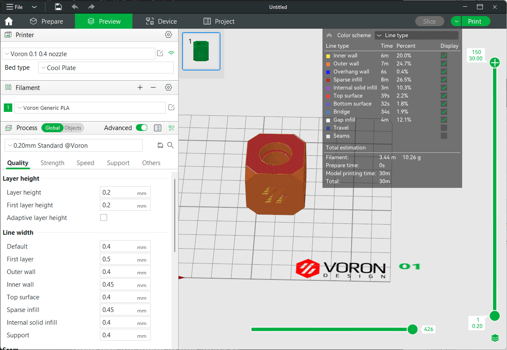

# Bambu Studio - SoftFever
A modified version of Bambu Studio with many handy features.   
It's fully compatible with Bambulab X1/X1-C printers.
It also supports Voron and Prusa MK3S printers.  
You can download it here: https://github.com/SoftFever/BambuStudio-SoftFever/releases

## BambuStudio SoftFever change notes:
### [V1.2.5.3 changes](https://github.com/SoftFever/BambuStudio-SoftFever/releases/tag/v1.2.5.3-sf):
1. Label objects to support Klipper Exclude Objects feature
2. Allow users to change output file name format
3. Fix a bug that pressure advance value was not saved in the profile
4. Optimize non-Bambu printer profiles
5. Remove M900 S0 which is not necessary.

### [V1.2.5 changes](https://github.com/SoftFever/BambuStudio-SoftFever/releases/tag/v1.2.5-sf):
1. Add options to adjust jerk for different line types
2. Add an option to adjust acceleration for travel. Higher acceleration for travel and lower acceleration for the outer wall makes it possible to print faster and nicer.
3. Add an option to manually override the Pressure Advance / Linear Advance for each filament.

### [V1.2.4 changes](https://github.com/SoftFever/BambuStudio-SoftFever/releases/tag/v1.2.4-sf):
1. Allow users to adjust accelerations for inner/outer walls separately.
2. Allow users to adjust the bottom surface flow-rate
3. Fix an issue that bed temperature for other layers is not set properly. This bug exists in the upstream as well. My PR here(bambulab#319)

### [V1.2 changes](https://github.com/SoftFever/BambuStudio-SoftFever/releases/tag/v1.2-sf):
1. Allow user to change machine limits
2. Allow users to adjust the top surface flow-rate.
3. Unlock some cool hidden features in BambuStudio.
4. Fix an issue that the software connected to Bambulab's staging server by default. (Only Bambulab machines were affected)

### [V1.1 changes](https://github.com/SoftFever/BambuStudio-SoftFever/releases/tag/v1.1):
1. Support third-party printers:
   - Voron 2.4
   - Voron Trident
   - Voron 0.1
   - Prusa MK3S
2. Export to to .gcode file.
3. Send gcode file to printer
4. Support single wall mode on first layer
5. Support Chamber temperature. This setting can be use in machine start G-Gcode
6. Support thumbview for third-party printers

Demo video: https://youtu.be/vSNE9iGj2II  
 
## NOTE: 
## - If you have troubles to run the build, you might need to install following runtimes:  
- [MicrosoftEdgeWebView2RuntimeInstallerX64](https://github.com/SoftFever/BambuStudio-SoftFever/releases/download/v1.0.10-sf2/MicrosoftEdgeWebView2RuntimeInstallerX64.exe)  
- [vcredist2019_x64](https://github.com/SoftFever/BambuStudio-SoftFever/releases/download/v1.0.10-sf2/vcredist2019_x64.exe)  

## - BambuStudio use G2/G3 commands by default. You need to turn on ARC support in your printer's firmware use with this slicer.
- For Voron and any Klipper based printers:  
You can enable gcode_arcs(G2/G3) support by adding following section into you printer.cfg file:  
```
[gcode_arcs]
resolution: 0.1

[gcode_macro m201]
gcode:
  
    
      SET_VELOCITY_LIMIT ACCEL={accel} ACCEL_TO_DECEL={accel * 0.5}
  
    SET_VELOCITY_LIMIT
  

[gcode_macro m203]
gcode:
  
    
    SET_VELOCITY_LIMIT VELOCITY={speed}
  
    SET_VELOCITY_LIMIT
  

[gcode_macro M205]
gcode:
  
    
    SET_VELOCITY_LIMIT SQUARE_CORNER_VELOCITY={corner_speed}
  
    SET_VELOCITY_LIMIT
  

[gcode_macro M900]
gcode:
      SET_PRESSURE_ADVANCE ADVANCE={params.K}

```

It's also recommended to add followinging dummy macros to make Klipper happy
```
# Make BambuStudio happy
[gcode_macro G17]
gcode:

[gcode_macro M981]
gcode:

[gcode_macro M1003]
gcode:
```

- For Prusa MK3S:  
ARC movement are supported by default.


# Gallery

  
  
  
  
  


Image credits: 
 1. Voron 2.4 and Trident: vorondesign.com
 3. Voron 0.1: myself
 4. Prusa MK3S: Prusa3d  


=========================SPLIT=========================     


# BambuStudio
Bambu Studio is a cutting-edge, feature-rich slicing software.  
It contains project-based workflows, systematically optimized slicing algorithms, and an easy-to-use graphic interface, bringing users an incredibly smooth printing experience.

Prebuilt Windows, macOS 64-bit releases are available through the [github releases page](https://github.com/bambulab/BambuStudio/releases/).  
Linux version currently is not supported.

Bambu Studio is based on [PrusaSlicer](https://github.com/prusa3d/PrusaSlicer) by Prusa Research, which is from [Slic3r](https://github.com/Slic3r/Slic3r) by Alessandro Ranellucci and the RepRap community.

See the [wiki](https://github.com/bambulab/BambuStudio/wiki) and the [documentation directory](https://github.com/bambulab/BambuStudio/tree/master/doc) for more informations.

# What are Bambu Studio's main features?
Key features are:
- Basic slicing features & GCode viewer
- Multiple plates management
- Remote control & monitoring
- Auto-arrange objects
- Auto-orient objects
- Hybrid/Tree/Normal support types, Customized support
- multi-material printing and rich painting tools
- multi-platform (Win/Mac/Linux) support
- Global/Object/Part level slicing parameters

Other major features are:
- Advanced cooling logic controlling fan speed and dynamic print speed
- Auto brim according to mechanical analysis
- Support arc path(G2/G3)
- Support STEP format
- Assembly & explosion view
- Flushing transition-filament into infill/object during filament change

# How to compile
Following platforms are currently supported to compile:
- Windows 64-bit, [Compile Guide](https://github.com/bambulab/BambuStudio/wiki/Windows-Compile-Guide)
- Mac 64-bit, [Compile Guide](https://github.com/bambulab/BambuStudio/wiki/Mac-Compile-Guide)

# Report issue
You can add an issue to the [github tracker](https://github.com/bambulab/BambuStudio/issues) if **it isn't already present.**

# License
Bambu Studio is licensed under the GNU Affero General Public License, version 3. Bambu Studio is based on PrusaSlicer by PrusaResearch.

PrusaSlicer is licensed under the GNU Affero General Public License, version 3. PrusaSlicer is owned by Prusa Research. PrusaSlicer is originally based on Slic3r by Alessandro Ranellucci.

Slic3r is licensed under the GNU Affero General Public License, version 3. Slic3r was created by Alessandro Ranellucci with the help of many other contributors.

The GNU Affero General Public License, version 3 ensures that if you use any part of this software in any way (even behind a web server), your software must be released under the same license.

The bambu networking plugin is based on non-free libraries. It is optional to the Bambu Studio and provides extended functionalities for users.

