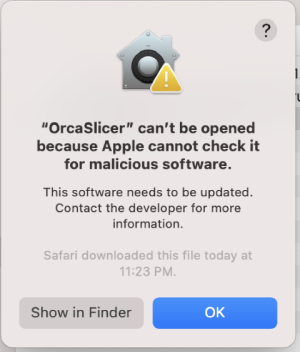
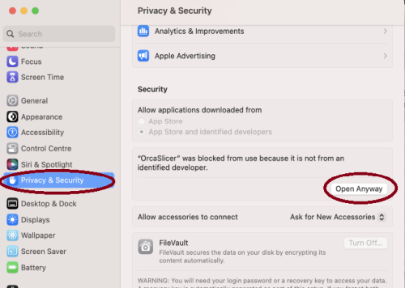

<div align="center">

<picture>
  
</picture>

<a href="https://trendshift.io/repositories/952" target="_blank"></a>

[](https://github.com/OrcaSlicer/OrcaSlicer/stargazers) [](https://github.com/OrcaSlicer/OrcaSlicer/actions/workflows/build_all.yml)

OrcaSlicer: an open source Next-Gen Slicing Software for Precision 3D Prints.  
Optimize your prints with ultra-fast slicing, intelligent support generation, and seamless printer compatibility—engineered for perfection.
<h3>

# Official links and community

#### Official Website:
<a href="https://www.orcaslicer.com/" style="font-size:2em;">OrcaSlicer.com</a>

#### Github Repository:
<a href="https://github.com/OrcaSlicer/OrcaSlicer"> </a>

#### Follow us:
<a href="https://twitter.com/real_OrcaSlicer"> </a>

#### Join our Discord community:
<a href="https://discord.gg/P4VE9UY9gJ"> </a>

<table border="2" style="border-color: #ffa500; background-color:rgb(232, 220, 180); color: #856404;">
<tr>
<td>
<strong>⚠️ CAUTION:</strong><br>
Several clickbait and malicious websites, such as <b>orca-slicer[.]com</b> and <b>orcaslicer[.]net</b>, are pretending to be the official OrcaSlicer site. These sites may redirect you to dangerous downloads or contain misleading information.<br>
<b>Our only official website is <a href="https://www.orcaslicer.com/">www.orcaslicer.com</a>.</b><br><br>
If you come across any of these in search results, please <b>report them</b> as unsafe or phishing to help keep the community secure with:<br>
 - <a href="https://safebrowsing.google.com/safebrowsing/report_phish/">Google Safe Browsing</a><br>
 - <a href="https://www.microsoft.com/en-us/wdsi/support/report-unsafe-site">Microsoft Security Intelligence</a><br>
 - <a href="https://ipthreat.net/tools/reportphishing">IPThreat</a>
</td>
</tr>
</table>

</div>

# Main features

- **[Advanced Calibration Tools](https://github.com/OrcaSlicer/OrcaSlicer/wiki/Calibration)**  
  Comprehensive suite: temperature towers, flow rate, retraction & more for optimal performance.
- **[Precise Wall](https://github.com/OrcaSlicer/OrcaSlicer/wiki/quality_settings_precision#precise-wall) and [Seam Control](https://github.com/OrcaSlicer/OrcaSlicer/wiki/quality_settings_seam)**  
  Adjust outer wall spacing and apply scarf seams to enhance print accuracy.
- **[Sandwich Mode](https://github.com/OrcaSlicer/OrcaSlicer/wiki/quality_settings_wall_and_surfaces#innerouterinner) and [Polyholes](https://github.com/OrcaSlicer/OrcaSlicer/wiki/quality_settings_precision#polyholes) Support**  
  Use varied infill [patterns](https://github.com/OrcaSlicer/OrcaSlicer/wiki/strength_settings_patterns) and accurate hole shapes for improved clarity.
- **[Overhang](https://github.com/OrcaSlicer/OrcaSlicer/wiki/quality_settings_overhangs) and [Support Optimization](https://github.com/OrcaSlicer/OrcaSlicer/wiki#support-settings)**  
  Modify geometry for printable overhangs with precise support placement.
- **[Granular Controls and Customization](https://github.com/OrcaSlicer/OrcaSlicer/wiki#process-settings)**  
  Fine-tune print speed, layer height, pressure, and temperature with precision.
- **Network Printer Support**  
  Seamless integration with Klipper, PrusaLink, and OctoPrint for remote control.
- **[Mouse Ear Brims](https://github.com/OrcaSlicer/OrcaSlicer/wiki/others_settings_brim) & [Adaptive Bed Mesh](https://github.com/OrcaSlicer/OrcaSlicer/wiki/printer_basic_information_adaptive_bed_mesh)**  
  Automatic brims and adaptive mesh calibration ensure consistent adhesion.
- **User-Friendly Interface**  
  Intuitive drag-and-drop design with pre-made profiles for popular printers.
- **[Open-Source](https://github.com/OrcaSlicer/OrcaSlicer) & [Community Driven](https://discord.gg/P4VE9UY9gJ)**  
  Regular updates fueled by continuous community contributions.
- **Wide Printer Compatibility**  
  Supports a broad range of printers: Bambu Lab, Prusa, Creality, Voron, and more.
- Additional features can be found in the [change notes](https://github.com/OrcaSlicer/OrcaSlicer/releases/).

# Wiki

The [wiki](https://github.com/OrcaSlicer/OrcaSlicer/wiki) aims to provide a detailed explanation of the slicer settings, including how to maximize their use and how to calibrate and set up your printer.

- **[Access the wiki here](https://github.com/OrcaSlicer/OrcaSlicer/wiki)**
- **[Contribute to the wiki](https://github.com/OrcaSlicer/OrcaSlicer/wiki/How-to-wiki)**

# Download

## Stable Release

📥 **[Download the Latest Stable Release](https://github.com/OrcaSlicer/OrcaSlicer/releases/latest)**  
Visit our GitHub Releases page for the latest stable version of OrcaSlicer, recommended for most users.

## Nightly Builds

🌙 **[Download the Latest Nightly Build](https://github.com/OrcaSlicer/OrcaSlicer/releases/tag/nightly-builds)**  
Explore the latest developments in OrcaSlicer with our nightly builds. Feedback on these versions is highly appreciated.

# How to install

## Windows

Download the **Windows Installer exe**  for your preferred version from the [releases page](https://github.com/OrcaSlicer/OrcaSlicer/releases).

 - *For convenience there is also a portable build available.*
    <details>
    <summary>Troubleshooting</summary>

    - *If you have troubles to run the build, you might need to install following runtimes:*
    - [MicrosoftEdgeWebView2RuntimeInstallerX64](https://github.com/OrcaSlicer/OrcaSlicer/releases/download/v1.0.10-sf2/MicrosoftEdgeWebView2RuntimeInstallerX64.exe)
        - [Details of this runtime](https://aka.ms/webview2)
        - [Alternative Download Link Hosted by Microsoft](https://go.microsoft.com/fwlink/p/?LinkId=2124703)
    - [vcredist2019_x64](https://github.com/OrcaSlicer/OrcaSlicer/releases/download/v1.0.10-sf2/vcredist2019_x64.exe)
        -  [Alternative Download Link Hosted by Microsoft](https://aka.ms/vs/17/release/vc_redist.x64.exe)
        -  This file may already be available on your computer if you've installed visual studio.  Check the following location: `%VCINSTALLDIR%Redist\MSVC\v142`
    </details>

Windows Package Manager

```shell
winget install --id=SoftFever.OrcaSlicer -e
```

## Mac

1. Download the DMG for your computer: `arm64` version for Apple Silicon and `x86_64` for Intel CPU.
2. Drag OrcaSlicer.app to Application folder.
3. *If you want to run a build from a PR, you also need to follow the instructions below:*

    <details>
    <summary>Quarantine</summary>

    - Option 1 (You only need to do this once. After that the app can be opened normally.):
      - Step 1: Hold _cmd_ and right click the app, from the context menu choose **Open**.
      - Step 2: A warning window will pop up, click _Open_

    - Option 2:
      Execute this command in terminal:

      ```shell
      xattr -dr com.apple.quarantine /Applications/OrcaSlicer.app
      ```

    - Option 3:
        - Step 1: open the app, a warning window will pop up  
            
        - Step 2: in `System Settings` -> `Privacy & Security`, click `Open Anyway`:  
            
    </details>

## Linux (Ubuntu)

 1. If you run into trouble executing it, try this command in the terminal:
    `chmod +x /path_to_appimage/OrcaSlicer_Linux.AppImage`

# How to Compile

All updated build instructions for Windows, macOS, and Linux are now available on the official [OrcaSlicer Wiki - How to build](https://github.com/OrcaSlicer/OrcaSlicer/wiki/How-to-build) page.

Please refer to the wiki to ensure you're following the latest and most accurate steps for your platform.

# Klipper Note

If you're running Klipper, it's recommended to add the following configuration to your `printer.cfg` file.

```gcode
# Enable object exclusion
[exclude_object]

# Enable arcs support
[gcode_arcs]
resolution: 0.1
```

# Supports

**OrcaSlicer** is an open-source project and I'm deeply grateful to all my sponsors and backers.  
Their generous support enables me to purchase filaments and other essential 3D printing materials for the project.  
Thank you! :)

## Sponsors:

<table>
<tr>
<td>
<a href="https://qidi3d.com/" style="display:inline-block; border-radius:8px; background:#fff;">
  
</a>
</td>
<td>
<a href="https://bigtree-tech.com/" style="display:inline-block; border-radius:8px; background:#222;">
    
</a>
</td>
</tr>
</table>

## Backers:

**Ko-fi supporters** ☕: [Backers list](https://github.com/user-attachments/files/16147016/Supporters_638561417699952499.csv)

## Support me

<a href="https://github.com/sponsors/SoftFever"></a>
<a href="https://ko-fi.com/G2G5IP3CP"></a>
<a href="https://paypal.me/softfever3d"></a>

## Some background

OrcaSlicer was originally forked from Bambu Studio, it was previously known as BambuStudio-SoftFever.

[Bambu Studio](https://github.com/bambulab/BambuStudio) is forked from [PrusaSlicer](https://github.com/prusa3d/PrusaSlicer) by Prusa Research, which is from [Slic3r](https://github.com/Slic3r/Slic3r) by Alessandro Ranellucci and the RepRap community.
OrcaSlicer incorporates a lot of features from [SuperSlicer](https://github.com/supermerill/SuperSlicer) by @supermerill
OrcaSlicer's logo is designed by community member Justin Levine (@freejstnalxndr).

# License

- **OrcaSlicer** is licensed under the GNU Affero General Public License, version 3. OrcaSlicer is based on Bambu Studio by BambuLab.
- **Bambu Studio** is licensed under the GNU Affero General Public License, version 3. Bambu Studio is based on PrusaSlicer by PrusaResearch.
- **PrusaSlicer** is licensed under the GNU Affero General Public License, version 3. PrusaSlicer is owned by Prusa Research. PrusaSlicer is originally based on Slic3r by Alessandro Ranellucci.
- **Slic3r** is licensed under the GNU Affero General Public License, version 3. Slic3r was created by Alessandro Ranellucci with the help of many other contributors.
- The **GNU Affero General Public License**, version 3 ensures that if you use any part of this software in any way (even behind a web server), your software must be released under the same license.
- OrcaSlicer includes a **pressure advance calibration pattern test** adapted from Andrew Ellis' generator, which is licensed under GNU General Public License, version 3. Ellis' generator is itself adapted from a generator developed by Sineos for Marlin, which is licensed under GNU General Public License, version 3.
- The **Bambu networking plugin** is based on non-free libraries from BambuLab. It is optional to the OrcaSlicer and provides extended functionalities for Bambulab printer users.
