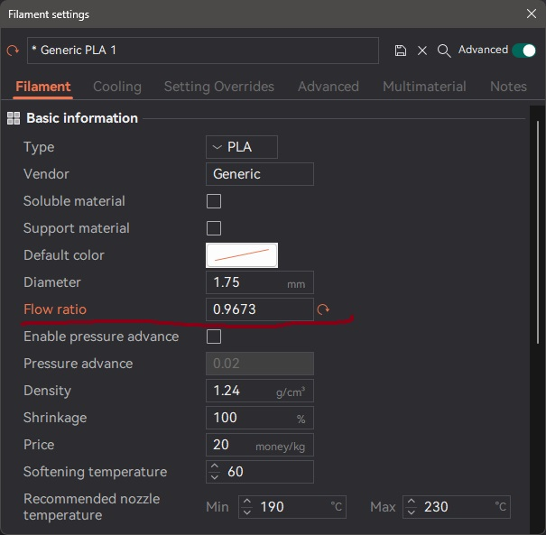
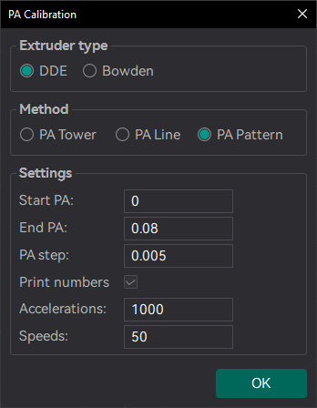
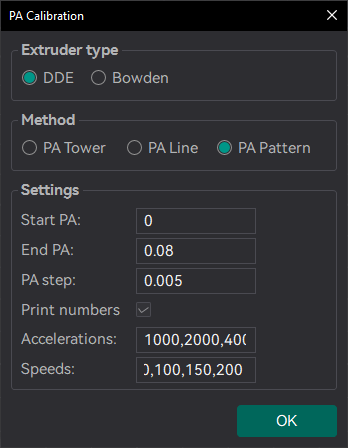
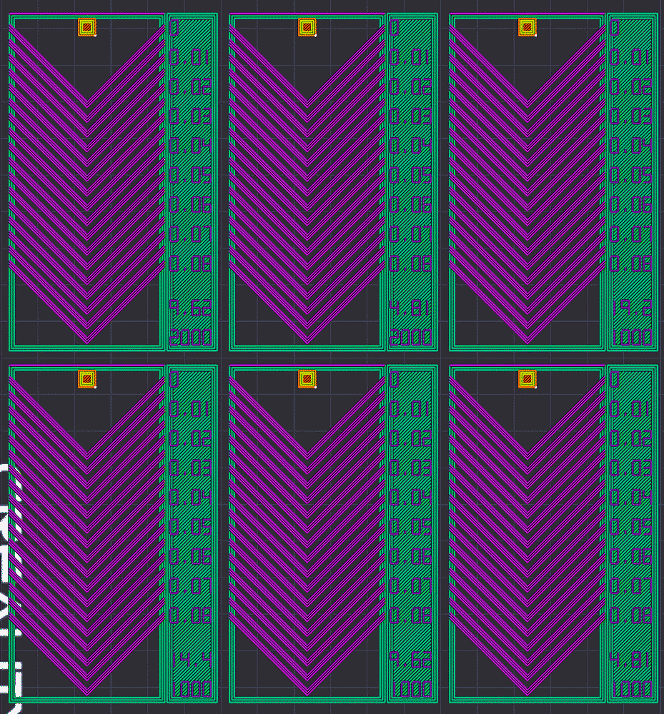
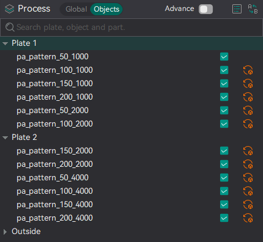
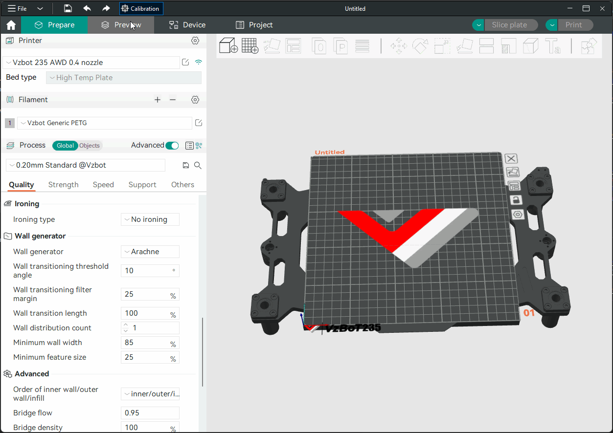
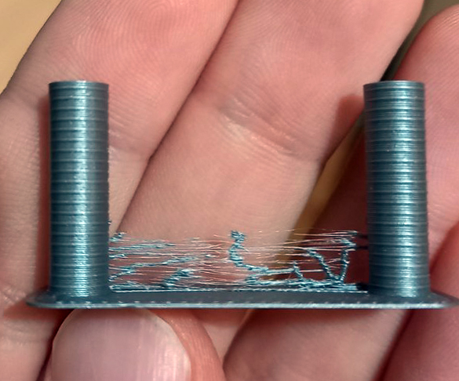

- [Flow rate](#Flow-rate)
- [Pressure Advance](#Pressure-Advance)
  1. [Line method](#Line-method)
  2. [Pattern method](#Pattern-method)
  3. [Tower method](#Tower-method)
- [Temp tower](#Temp-tower)
- [Retraction test](#Retraction-test)
- [Orca Tolerance Test](#Orca-Tolerance-Test)
- [Advanced calibration](#Advanced-Calibration)
  1. [Max Volumetric speed](#Max-Volumetric-speed)
  2. [VFA]  

> [!IMPORTANT]
> After completing the calibration process, remember to create a new project in order to exit the calibration mode.

> [!TIP]
> @ItsDeidara has made a webpage to help with the calculation. Check it out if those equations give you a headache [here](https://orcalibrate.com/).

# Flow rate
> [!WARNING]
> For Bambulab X1/X1C users, make sure you do not select the 'Flow calibration' option.
> 
>   

Calibrating the flow rate involves a two-step process.  
Steps
1. Select the printer, filament, and process you would like to use for the test.
2. Select `Pass 1` in the `Calibration` menu
3. A new project consisting of nine blocks will be created, each with a different flow rate modifier. Slice and print the project.
4. Examine the blocks and determine which one has the smoothest top surface.

5. Update the flow ratio in the filament settings using the following equation: `FlowRatio_old*(100 + modifier)/100`. If your previous flow ratio was `0.98` and you selected the block with a flow rate modifier of `+5`, the new value should be calculated as follows: `0.98x(100+5)/100 = 1.029`.** Remember** to save the filament profile.
6. Perform the `Pass 2` calibration. This process is similar to `Pass 1`, but a new project with ten blocks will be generated. The flow rate modifiers for this project will range from `-9 to 0`.
7. Repeat steps 4. and 5. In this case, if your previous flow ratio was 1.029 and you selected the block with a flow rate modifier of -6, the new value should be calculated as follows: `1.029x(100-6)/100 = 0.96726`. **Remember** to save the filament profile.  

  
  

# Pressure Advance

Orca Slicer includes three approaches for calibrating the pressure advance value. Each method has its own advantages and disadvantages. It is important to note that each method has two versions: one for a direct drive extruder and one for a Bowden extruder. Make sure to select the appropriate version for your test.

> [!WARNING]
> For Marlin: Linear advance must be enabled in firmware (M900). **Not all printers have it enabled by default.**

> [!WARNING]
> For Bambulab X1/X1C users, make sure you do not select the 'Flow calibration' option when printings.
> 
> 

### Line method

The line method is quick and straightforward to test. However, its accuracy highly depends on your first layer quality. It is suggested to turn on the bed mesh leveling for this test.
Steps:
  1. Select the printer, filament, and process you would like to use for the test.
  2. Print the project and check the result. You can select the value of the most even line and update your PA value in the filament settings.
  3. In this test, a PA value of `0.016` appears to be optimal.

### Pattern method

The pattern method is adapted from [Andrew Ellis' pattern method generator](https://ellis3dp.com/Pressure_Linear_Advance_Tool/), which was itself derived from the [Marlin pattern method](https://marlinfw.org/tools/lin_advance/k-factor.html) developed by [Sineos](https://github.com/Sineos/k-factorjs).

[Instructions for using and reading the pattern method](https://ellis3dp.com/Print-Tuning-Guide/articles/pressure_linear_advance/pattern_method.html) are provided in [Ellis' Print Tuning Guide](https://ellis3dp.com/Print-Tuning-Guide/), with only a few Orca Slicer differences to note.

Test configuration window allow user to generate one or more tests in a single projects. Multiple tests will be placed on each plate with extra plates added if needed.

1. Single test \

2. Batch mode testing (multiple tests on a sinle plate) \

Once test generated, one or more small rectangular prisms could be found on the plate, one for each test case. This object serves a few purposes:

1. The test pattern itself is added in as custom G-Code at each layer, same as you could do by hand actually. The rectangular prism gives us the layers in which to insert that G-Code. This also means that **you'll see the full test pattern when you move to the Preview pane**:

2. The prism acts as a handle, enabling you to move the test pattern wherever you'd like on the plate by moving the prism
3. Each test object is pre-configured with target parameters which are reflected in the objects name. However, test parameters may be adjusted for each prism individually by referring to the object list pane:

Next, Ellis' generator provided the ability to adjust specific printer, filament, and print profile settings. You can make these same changes in Orca Slicer by adjusting the settings in the Prepare pane as you would with any other print. When you initiate the calibration test, Ellis' default settings are applied. A few things to note about these settings:

1. Ellis specified line widths as a percent of filament diameter. The Orca pattern method does the same to provide its suggested defaults, making use of Ellis' percentages in combination with your specified nozzle diameter
2. In terms of line width, the pattern only makes use of the `Default` and `First layer` widths
3. In terms of speed, the pattern only uses the `First layer speed -> First layer` and `Other layers speed -> Outer wall` speeds
4. The infill pattern beneath the numbers cannot be changed becuase it's not actually an infill pattern pulled from the settings. All of the pattern G-Code is custom written, so that "infill" is, effectively, hand-drawn and so not processed through the usual channels that would enable Orca to recognize it as infill

### Tower method

The tower method may take a bit more time to complete, but it does not rely on the quality of the first layer. 
The PA value for this test will be increased by 0.002 for every 1 mm increase in height.  (**NOTE** 0.02 for Bowden)  
Steps:
 1. Select the printer, filament, and process you would like to use for the test.
 2. Examine each corner of the print and mark the height that yields the best overall result.
 3. I selected a height of 8 mm for this case, so the pressure advance value should be calculated as `PressureAdvanceStart+(PressureAdvanceStep x measured)` example: `0+(0.002 x 8) = 0.016`.

# Temp tower 
  
Temp tower is a straightforward test. The temp tower is a vertical tower with multiple blocks, each printed at a different temperature. Once the print is complete, we can examine each block of the tower and determine the optimal temperature for the filament. The optimal temperature is the one that produces the highest quality print with the least amount of issues, such as stringing, layer adhesion, warping (overhang), and bridging.  
  

# Retraction test
  
This test generates a retraction tower automatically. The retraction tower is a vertical structure with multiple notches, each printed at a different retraction length. After the print is complete, we can examine each section of the tower to determine the optimal retraction length for the filament. The optimal retraction length is the shortest one that produces the cleanest tower.  
  
In the dialog, you can select the start and end retraction length, as well as the retraction length increment step. The default values are 0mm for the start retraction length, 2mm for the end retraction length, and 0.1mm for the step. These values are suitable for most direct drive extruders. However, for Bowden extruders, you may want to increase the start and end retraction lengths to 1mm and 6mm, respectively, and set the step to 0.2mm.

**Note**: When testing filaments such as PLA or ABS that have minimal oozing, the retraction settings can be highly effective. You may find that the retraction tower appears clean right from the start. In such situations, setting the retraction length to 0.2mm - 0.4mm using Orca Slicer should suffice.
On the other hand, if there is still a lot of stringing at the top of the tower, it is recommended to dry your filament and ensure that your nozzle is properly installed without any leaks.  
  

# Orca Tolerance Test
This tolerance test is specifically designed to assess the dimensional accuracy of your printer and filament. The model comprises a base and a hexagon tester. The base contains six hexagon hole, each with a different tolerance: 0.0mm, 0.05mm, 0.1mm, 0.2mm, 0.3mm, and 0.4mm. The dimensions of the hexagon tester are illustrated in the image.  
 

You can assess the tolerance using either an M6 Allen key or the printed hexagon tester.  
  
  

# Advanced Calibration

## Max Volumetric speed
This is a test designed to calibrate the maximum volumetric speed of the specific filament. The generic or 3rd party filament types may not have the correct volumetric flow rate set in the filament. This test will help you to find the maximum volumetric speed of the filament.

You will be promted to enter the settings for the test: start volumetric speed, end volumentric speed, and step. It is recommended to use the default values (5mm³/s start, 20mm³/s end, with a step of 0.5), unless you already have an idea of the lower or upper limit for your filament. Select "OK", slice the plate, and send it to the printer. 

Once printed, take note of where the layers begin to fail and where the quality begins to suffer. Pay attention to changes from matte to shiny as well. 

Using calipers or a ruler, measure the height of the print at that point. Use the following calculation to determine the correct max flow value: `start + (height-measured * step)` . For example in the photo below, and using the default setting values, the print quality began to suffer at 19mm measured, so the calculation would be: `5 + (19 * 0.5)` , or `13mm³/s` using the default values. Enter your number into the  "Max volumetric speed" value in the filament settings.

You can also return to OrcaSlicer in the "Preview" tab, make sure the color scheme "flow" is selected. Scroll down to the layer height that you measured, and click on the toolhead slider. This will indicate the max flow level for your filmanet. 

> [!NOTE]
> You may also choose to conservatively reduce the flow by 5-10% to ensure print quality.

***
*Credits:*  
- *The Flowrate test and retraction test is inspired by [SuperSlicer](https://github.com/supermerill/SuperSlicer)*  
- *The PA Line method is inspired by [K-factor Calibration Pattern](https://marlinfw.org/tools/lin_advance/k-factor.html)*     
- *The PA Tower method is inspired by [Klipper](https://www.klipper3d.org/Pressure_Advance.html)*
- *The temp tower model is remixed from [Smart compact temperature calibration tower](https://www.thingiverse.com/thing:2729076)
- *The max flowrate test was inspired by Stefan(CNC Kitchen), and the model used in the test is a remix of his [Extrusion Test Structure](https://www.printables.com/model/342075-extrusion-test-structure).
- *ChatGPT* ;)
