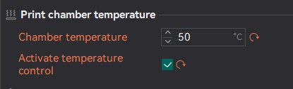

OrcaSlicer use `M141/M191` command to control active chamber heater.  

If `Activate temperature control` is checked, OrcaSlicer will insert `M191` command at the beginning of the gcode(before `Machine G-code`).  
  
*Note: If the machine is equipped with an auxiliary fan, OrcaSlicer will automatically activate the fan during the heating period to help circulate air in the chamber.*  


There are two chamber temperature variables available that we can use in `Machine G-code` to control the chamber temperature, if you prefer:  
To access the chamber temperature set in the first filament, use:  
`M191 S{chamber_temperature[0]}`  
To use the overall chamber temperature, which is the highest chamber temperature set across all filaments, use:    
`M191 S{overall_chamber_temperature}`


--------------------------Klipper--------------------------  
If you are using Klipper, you can define these macros to control the active chamber heater.  
Bellow is a reference configuration for Klipper.   
*Note: Don't forget to change the pin name/values to the actual values you are using in the configuration*

```
[heater_generic chamber_heater]
heater_pin:PB10
max_power:1.0
# Orca note: here the temperature sensor should be the sensor you are using for chamber temperature, not the PTC sensor
sensor_type:NTC 100K MGB18-104F39050L32
sensor_pin:PA1
control = pid
pid_Kp = 63.418 
pid_ki = 0.960
pid_kd = 1244.716
min_temp:0
max_temp:70

[gcode_macro M141]
gcode:
    SET_HEATER_TEMPERATURE HEATER=chamber_heater TARGET={params.S|default(0)}

[gcode_macro M191]
gcode:
    
    
        # If target temperature is 0, do nothing
        M117 Chamber heating cancelled
    
        SET_HEATER_TEMPERATURE HEATER=chamber_heater TARGET={s}
        # Orca: uncomment the following line if you want to use heat bed to assist chamber heating
        # M140 S100
        TEMPERATURE_WAIT SENSOR="heater_generic chamber_heater" MINIMUM={s-1} MAXIMUM={s+1}
        M117 Chamber at target temperature
    

```