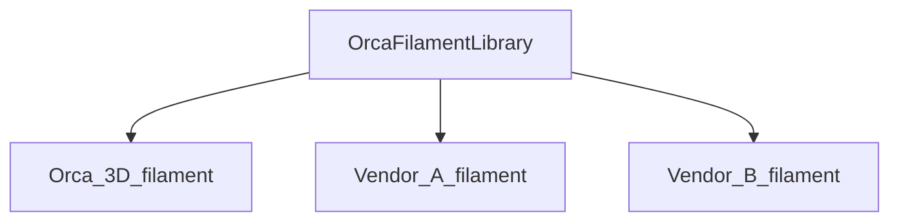

# Guide: Develop Profiles for OrcaSlicer

## Introduction

This guide will help you develop profiles for OrcaSlicer.

## High-level Overview

OrcaSlicer uses JSON files to store profiles. There are four types of profiles:

1. Printer model (type `machine_model`). Example: `Orca 3D Fuse1.json`
2. Printer variant (type `machine`). Example: `Orca 3D Fuse1 0.2 nozzle.json`
3. Filament (type `filament`). Example: `Generic PLA @Orca 3D Fuse1@.json`
4. Process (type `process`). Example: `0.10mm Standard @Orca 3D Fuse1 0.2.json`

Additionally, there is an overall meta file for each vendor (`Orca 3D.json`).

For easier understanding, let's consider a scenario with a printer manufacturer called `Orca 3D`. The manufacturer offers one printer model called `Fuse 1`, which supports 0.2/0.4/0.6/0.8mm nozzles and common market filaments.

In this case:

- Vendor profile: `Orca 3D`
- Printer profile: `Orca 3D Fuse1`
- Printer variant profile: `Orca 3D Fuse1 0.4 nozzle`
- Filament profile: `Generic PLA @Orca 3D Fuse1@`
- Process profile: `0.20mm Standard @Orca 3D Fuse1 0.4`

The profile name should be same as the filename without the `.json` extension in principal.
Naming conventions:

1. Vendor profile: `vendor_name.json`
2. Printer profile: `vendor_name` + `printer_name` + `.json`
3. Printer variant profile: `vendor_name` + `printer_variant_name` + `.json` (where `printer_variant_name` typically includes `printer_name` + `nozzle_diameter`)
4. Filament profile: `filament_vendor_name` + `filament_name` + " @" + `vendor_name` + `printer_name`/`printer_variant_name` + `.json`
5. Process profile: `layer_height` + `preset_name` + " @" + `vendor_name` + `printer_name`/`printer_variant_name` + `.json` (`preset_name` typically includes "standard," "fine," "fast," "draft," etc.)

## File Structure and Templates

Profiles should be structured in the following way under the OrcaSlicer installation directory:

```plaintext
resources\profiles\
    ├── Orca 3D.json
    └── Orca 3D\
        ├── machine\
        │   ├── Orca 3D Fuse1.json
        │   ├── Orca 3D Fuse1 0.2 nozzle.json
        │   └── Orca 3D Fuse1 0.4 nozzle.json
        ├── process\
        │   ├── 0.10mm Standard @Orca 3D Fuse1 0.2.json
        │   └── 0.20mm Standard @Orca 3D Fuse1 0.4.json
        └── filament\
            └── Generic PLA @Orca 3D Fuse1@.json
```

> [!TIP]
> Use short vendor names in filenames to avoid excessive length.

> [!NOTE]
> Filament profiles are **optional**. Create them only if the vendor has specifically tuned profiles for the given printer. See [Filament profiles](#filament-profiles) for details.

Template files for profiles are available in:

```shell
OrcaSlicer\resources\profiles_template\Template
```

These templates can be used as a starting point for new printer, filament, and process profiles.

## Filament Profiles

OrcaSlicer features a global filament library called `OrcaFilamentLibrary`, which is automatically available for all printers. It includes generic filaments like `Generic PLA @System` and `Generic ABS @System` etc.

Printer vendors can override specific filaments in the global library for certain printer models by creating new filament profiles.

Relationship diagram:



> [!IMPORTANT]
> Create new filament profiles only if you have truly specifically tuned the filament for the given printer. Otherwise, use the global library. The global library has a better chance to receive optimizations and updates from OrcaSlicer contributors, which will benefit users of all printers.

### Adding Filament Profiles to the Global Library

In this section, we will discuss how to add a new filament profile into the global library.
If you want to add a new generic profile into the global library, you need to create a new file in the `resources\profiles\OrcaFilamentLibrary\filament` folder. If a base type already exists in the global library, you can use this file as a base profile by inheriting it.
The following sample JSON file shows how to create a new generic filament profile `Generic PLA-GF @System` in the global library.

1. The first step is to create a new file in the `resources\profiles\OrcaFilamentLibrary\filament` folder. The file name should be `Generic PLA-GF @System.json`. Please note that we leave the `compatible_printers` field empty so that it is available for all printers.

```json
{
    "type": "filament",
    "filament_id": "GFL99",
    "setting_id": "GFSA05",
    "name": "Generic PLA-GF @System",
    "from": "system",
    "instantiation": "true",
    "inherits": "fdm_filament_pla",
    "filament_type": ["PLA-GF"],
    "filament_flow_ratio": [
        "0.96"
    ],
    "compatible_printers": []
}
```

2. Register the profile in `resources\profiles\OrcaFilamentLibrary.json`:

```json
{
    "name": "OrcaFilamentLibrary",
    "version": "02.02.00.04",
    "force_update": "0",
    "description": "Orca Filament Library",
    "filament_list": [
        // ...
        {
            "name": "Generic PLA-GF @System",
            "sub_path": "filament/Generic PLA-GF @System.json"
        }
    ]
}
```

3. The last step is to validate the newly added filament profiles see [Validate Profiles](#validate-profiles).

> [!NOTE]
> If the filament is compatible with AMS, ensure that the `filament_id` value **does not exceed 8 characters** to maintain AMS compatibility.

### Adding Filament Profiles to Printer Vendor Library

In this section, we will discuss how to add a new filament profile for a certain vendor.
If you want to add a new filament profile, whether it's a brand new profile or a specialized version of a global filament profile for a given printer, you need to create a new file in the `resources\profiles\vendor_name\filament` folder. If a base type already exists in the global library, you can use this file as a base profile by inheriting it.
Below is a sample JSON file showing how to create a specialized `Generic ABS` filament profile for the ToolChanger printer.
Please note that here we must leave the compatible_printers field non-empty, unlike in the global library.

```json
{
    "type": "filament",
    "setting_id": "GFB99_MTC_0",
    "name": "Generic ABS @MyToolChanger",
    "from": "system",
    "instantiation": "true",
    "inherits": "Generic ABS @System",
    "filament_cooling_final_speed": [
        "3.5"
    ],
    "filament_cooling_initial_speed": [
        "10"
    ],
    "filament_cooling_moves": [
        "2"
    ],
    "filament_load_time": [
        "10.5"
    ],
    "filament_loading_speed": [
        "10"
    ],
    "filament_loading_speed_start": [
        "50"
    ],
    "filament_multitool_ramming": [
        "1"
    ],
    "filament_multitool_ramming_flow": [
        "40"
    ],
    "filament_stamping_distance": [
        "45"
    ],
    "filament_stamping_loading_speed": [
        "29"
    ],
    "filament_unload_time": [
        "8.5"
    ],
    "filament_unloading_speed": [
        "100"
    ],
    "compatible_printers": [
        "MyToolChanger 0.4 nozzle",
        "MyToolChanger 0.2 nozzle",
        "MyToolChanger 0.6 nozzle",
        "MyToolChanger 0.8 nozzle"
    ]
}
```

> [!NOTE]
> If the filament is compatible with AMS, ensure that the `filament_id` value **does not exceed 8 characters** to maintain AMS compatibility.

## Process Profiles

Process profiles define print quality and behavior. They follow a structure similar to filament profiles:

- A common base file, e.g., `fdm_process_common.json`, acts as the parent.
- Vendor-specific process profiles should inherit from the base using the `inherits` field.
- Profiles are stored under:

```shell
resources\profiles\vendor_name\process\
```

- **There are no global process profiles**.
- Each process profile includes a `"compatible_printers"` field with an array of compatible printer variant names.

Example:

```json
{
  "type": "process",
  "name": "0.10mm Standard @ExampleVendor Printer 0.2",
  "inherits": "fdm_process_common",
  "from": "system",
  "instantiation": "true",
  "compatible_printers": [
    "ExampleVendor Printer 0.2 nozzle"
  ]
}
```

## Printer Model Profiles

- Printer model profiles (type `machine_model`) describe the general printer information.
- Example fields: `nozzle_diameter`, `bed_model`, `bed_texture`, `model_id`, etc.
- Stored in:

```shell
resources\profiles\vendor_name\machine\
```

- Each vendor's folder may contain an image named:

```shell
[machine_model_list.name]_cover.png
```

This image will be used in the UI.

Example model profile:

```json
{
  "type": "machine_model",
  "name": "Example M5",
  "nozzle_diameter": "0.2;0.25;0.4;0.6",
  "bed_model": "M5-Example-bed.stl",
  "bed_texture": "M5-Example-texture.svg",
  "model_id": "V1234",
  "family": "Example",
  "machine_tech": "FFF",
  "default_materials": "Example Generic PLA;Example Generic PETG"
}
```

## Printer Variant Profiles

- Printer variants (type `machine`) define specific nozzle configurations and mechanical details.
- Each variant must inherit from a common base like `fdm_machine_common.json`.
- Must list the compatible nozzle diameter in the `nozzle_diameter` array.
- Example fields include `printer_model`, `printer_variant`, `default_print_profile`, `printable_area`, etc.

Example variant profile:

```json
{
  "type": "machine",
  "name": "Example M5 0.2 nozzle",
  "inherits": "fdm_machine_common",
  "from": "system",
  "setting_id": "GM001",
  "instantiation": "true",
  "nozzle_diameter": ["0.2"],
  "printer_model": "Example M5",
  "printer_variant": "0.2",
  "default_filament_profile": ["Example Generic PLA"],
  "default_print_profile": "0.10mm Standard 0.2mm nozzle @Example",
  "printable_area": ["0x0", "235x0", "235x235", "0x235"],
  "nozzle_type": "brass"
}
```

## Models

- The `model` directory under the vendor folder is intended to behave similarly to `machine` profiles.
- Used for additional printer-related 3D models or definitions, stored at:

```
resources\profiles\vendor_name\model\
```

## Vendor Meta File

Each vendor must include a JSON file in the `resources\profiles` directory, named `vendor_name.json`. This file lists all available models, variants, processes, and filaments:

Example:

```json
{
  "name": "ExampleVendor",
  "version": "01.00.00.00",
  "force_update": "1",
  "description": "Example configuration",
  "machine_model_list": [
    {
      "name": "Example M5",
      "sub_path": "machine/Example M5.json"
    }
  ],
  "machine_list": [
    {
      "name": "fdm_machine_common",
      "sub_path": "machine/fdm_machine_common.json"
    }
  ],
  "process_list": [
    {
      "name": "fdm_process_common",
      "sub_path": "process/fdm_process_common.json"
    }
  ],
  "filament_list": [
    {
      "name": "fdm_filament_common",
      "sub_path": "filament/fdm_filament_common.json"
    }
  ]
}
```

## Validate Profiles

You can validate your profiles using both the **OrcaSlicer profile validator** and the **Python validation script**. These tools are designed to check different aspects of the profiles, so both should be executed and pass without errors to ensure full compatibility.

> [!NOTE]
> **✅ Recommendation:** Always run **both** the OrcaSlicer validator and the Python script to ensure all aspects of the profiles are valid.

### 1. OrcaSlicer Profile Validator

You can run OrcaSlicer to verify if the filament you just added is available and usable. You can also use the [Orca profile validator](https://github.com/SoftFever/Orca_tools/releases/tag/1) tool to help debug any errors.

> [!IMPORTANT]
> You need to delete the `%appdata%/OrcaSlicer/system` folder to force OrcaSlicer to reload your lastest changes.

The process is the same if you want to add a new brand filament profile into the global library. You need to create a new file in the `resources\profiles\OrcaFilamentLibrary\filament\brand_name` folder. The only difference is that you should put the file into the brand's own subfolder.

#### Usage

```shell
-h [ --help ] help
-p [ --path ] arg profile folder
-v [ --vendor ] arg Vendor name. Optional, all profiles present in the folder will be validated if not specified
-l [ --log_level ] arg (=2) Log level. Optional, default is 2 (warning). Higher values produce more detailed logs.
```

#### Example

```shell
./OrcaSlicer_profile_validator -p ~/codes/OrcaSlicer/resources/profiles -l 2 -v Custom
```

#### Sample result with errors

```shell
PS D:\codes\OrcaSlicer> ."D:/codes/OrcaSlicer/build/src/Release/OrcaSlicer_profile_validator.exe" --path d:\codes\OrcaSlicer\resources\profiles -l 2 -v Custom
[2024-02-28 21:23:06.102138] [0x0000a4e8] [error]   Slic3r::ConfigBase::load_from_json: parse d:\codes\OrcaSlicer\resources\profiles/Custom/machine/fdm_klipper_common.json got a nlohmann::detail::parse_error, reason = [json.exception.parse_error.101] parse error at line 9, column 38: syntax error while parsing object - unexpected string literal; expected '}'
...
Validation failed
```

#### Sample result with success

```shell
PS D:\codes\OrcaSlicer\build\src\RelWithDebInfo> ."D:/codes/OrcaSlicer/build/src/Release/OrcaSlicer_profile_validator.exe" --path d:\codes\OrcaSlicer\resources\profiles -l 2 -v Custom
Validation completed successfully
```

> [!WARNING]
> Use `OrcaSlicer_profile_validator` on Ubuntu and `OrcaSlicer_profile_validator.exe` on Windows.

---

### 2. Python Profile Validation Script

In addition to the Orca validator, you should run the `orca_extra_profile_check.py` script. This script performs additional checks like:

- Validation of `compatible_printers` in filament profiles
- Consistency of filament names
- Validation of default materials in machine profiles (optional)

#### Example command

```shell
python ./orca_extra_profile_check.py
```

You can also enable or disable specific checks:

- `--vendor` (optional): checks only the specified vendor. If omitted, all vendors are checked.
- `--check-filaments` (enabled by default): checks `compatible_printers` fields in filament profiles
- `--check-materials`: checks default material names in machine profiles

#### Sample usage with all checks enabled

```shell
python ./orca_extra_profile_check.py --vendor="vendor_name" --check-filaments --check-materials
```

The script will output the number of errors found and exit with a non-zero status code if any issues are detected.
