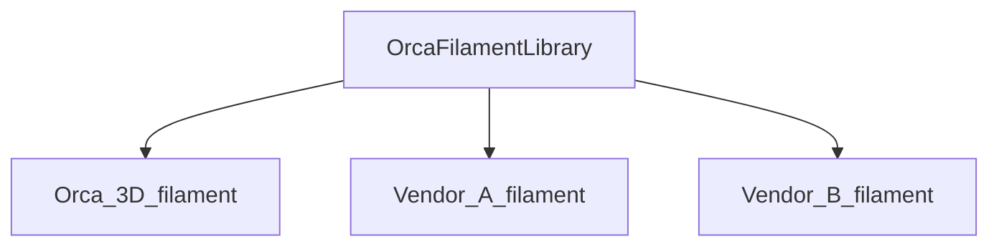

# Guide: Develop Profiles for OrcaSlicer

## Introduction
This guide will help you develop profiles for OrcaSlicer.

## High-level Overview
OrcaSlicer uses JSON files to store profiles. There are four types of profiles:
1. Printer model (type `machine_model`). Example: `Orca 3D Fuse1.json`
2. Printer variant (type `machine`). Example: `Orca 3D Fuse1 0.2 nozzle.json`
3. Filament (type `filament`). Example: `Generic PLA @Orca 3D Fuse1@.json`
4. Process (type `process`). Example: `0.10mm Standard @Orca 3D Fuse1 0.2.json`

Additionally, there is an overall meta file for each vendor (`Orca 3D.json`).

For easier understanding, let's consider a scenario with a printer manufacturer called `Orca 3D`. The manufacturer offers one printer model called `Fuse 1`, which supports 0.2/0.4/0.6/0.8mm nozzles and common market filaments.

In this case:
- Vendor profile: `Orca 3D`
- Printer profile: `Orca 3D Fuse1`
- Printer variant profile: `Orca 3D Fuse1 0.4 nozzle`
- Filament profile: `Generic PLA @Orca 3D Fuse1@`
- Process profile: `0.20mm Standard @Orca 3D Fuse1 0.4`

The profile name should be same as the filename without the `.json` extension in principal.
Naming conventions:
1. Vendor profile: `vendor_name.json`
2. Printer profile: `vendor_name` + `printer_name` + `.json`
3. Printer variant profile: `vendor_name` + `printer_variant_name` + `.json` (where `printer_variant_name` typically includes `printer_name` + `nozzle_diameter`)
4. Filament profile: `filament_vendor_name` + `filament_name` + " @" + `vendor_name` + `printer_name`/`printer_variant_name` + `.json`
5. Process profile: `layer_height` + `preset_name` + " @" + `vendor_name` + `printer_name`/`printer_variant_name` + `.json` (`preset_name` typically includes "standard," "fine," "fast," "draft," etc.)


A typical file structure for a vendor:
```
resources\profiles\
    - Orca 3D.json
    - Orca 3D\
        - machine\
            - Orca 3D Fuse1.json
            - Orca 3D Fuse1 0.2 nozzle.json
            - Orca 3D Fuse1 0.4 nozzle.json
        - process\
            - 0.10mm Standard @Orca 3D Fuse1 0.2.json
            - 0.20mm Standard @Orca 3D Fuse1 0.4.json
        - filament\
            - Generic PLA @Orca 3D Fuse1@.json
```


**NOTE 1**: Use short vendor names in filenames to avoid excessive length.
**NOTE 2**: Filament profiles are **optional**. Create them only if the vendor has specifically tuned profiles for the given printer. See [Filament profiles](#filament-profiles) for details.

## Filament Profiles
OrcaSlicer features a global filament library called `OrcaFilamentLibrary`, which is automatically available for all printers. It includes generic filaments like `Generic PLA @System` and `Generic ABS @System` etc.

Printer vendors can override specific filaments in the global library for certain printer models by creating new filament profiles. 

Relationship diagram:


**NOTE**: Create new filament profiles only if you have truly specifically tuned the filament for the given printer. Otherwise, use the global library. The global library has a better chance to receive optimizations and updates from OrcaSlicer contributors, which will benefit users of all printers.

### Adding Filament Profiles to the Global Library
In this section, we will discuss how to add a new filament profile into the global library.
If you want to add a new generic profile into the global library, you need to create a new file in the `resources\profiles\OrcaFilamentLibrary\filament` folder. If a base type already exists in the global library, you can use this file as a base profile by inheriting it.
The following sample JSON file shows how to create a new generic filament profile `Generic PLA-GF @System` in the global library.

1. The first step is to create a new file in the `resources\profiles\OrcaFilamentLibrary\filament` folder. The file name should be `Generic PLA-GF @System.json`. Please note that we leave the `compatible_printers` field empty so that it is available for all printers.

```json
{
    "type": "filament",
    "filament_id": "GFL99",
    "setting_id": "GFSA05",
    "name": "Generic PLA-GF @System",
    "from": "system",
    "instantiation": "true",
    "inherits": "fdm_filament_pla",
    "filament_type": ["PLA-GF"],
    "filament_flow_ratio": [
        "0.96"
    ],
    "compatible_printers": []
}
```

2. Register the profile in `resources\profiles\OrcaFilamentLibrary.json`:

```json
{
    "name": "OrcaFilamentLibrary",
    "version": "02.02.00.04",
    "force_update": "0",
    "description": "Orca Filament Library",
    "filament_list": [
        // ...
        {
            "name": "Generic PLA-GF @System",
            "sub_path": "filament/Generic PLA-GF @System.json"
        }
    ]
}
```

3. The last step is to validate the newly added filament profiles. You can run OrcaSlicer to verify if the filament you just added is available and usable. You can also use the [Orca profile validator](https://github.com/SoftFever/Orca_tools/releases/tag/1) tool to help debug any errors. **NOTE**: You need to delete the `%appdata%/OrcaSlicer/system` folder to force OrcaSlicer to reload your lastest changes.

The process is the same if you want to add a new brand filament profile into the global library. You need to create a new file in the `resources\profiles\OrcaFilamentLibrary\filament\brand_name` folder. The only difference is that you should put the file into the brand's own subfolder.`resources\profiles\OrcaFilamentLibrary\filament\brand_name`.

### Adding Filament Profiles to Printer Vendor Library
In this section, we will discuss how to add a new filament profile for a certain vendor.
If you want to add a new filament profile, whether it's a brand new profile or a specialized version of a global filament profile for a given printer, you need to create a new file in the `resources\profiles\vendor_name\filament` folder. If a base type already exists in the global library, you can use this file as a base profile by inheriting it.
Below is a sample JSON file showing how to create a specialized `Generic ABS` filament profile for the ToolChanger printer.
Please note that here we must leave the compatible_printers field non-empty, unlike in the global library.

```json
{
    "type": "filament",
    "setting_id": "GFB99_MTC_0",
    "name": "Generic ABS @MyToolChanger",
    "from": "system",
    "instantiation": "true",
    "inherits": "Generic ABS @System",
    "filament_cooling_final_speed": [
        "3.5"
    ],
    "filament_cooling_initial_speed": [
        "10"
    ],
    "filament_cooling_moves": [
        "2"
    ],
    "filament_load_time": [
        "10.5"
    ],
    "filament_loading_speed": [
        "10"
    ],
    "filament_loading_speed_start": [
        "50"
    ],
    "filament_multitool_ramming": [
        "1"
    ],
    "filament_multitool_ramming_flow": [
        "40"
    ],
    "filament_stamping_distance": [
        "45"
    ],
    "filament_stamping_loading_speed": [
        "29"
    ],
    "filament_unload_time": [
        "8.5"
    ],
    "filament_unloading_speed": [
        "100"
    ],
    "compatible_printers": [
        "MyToolChanger 0.4 nozzle",
        "MyToolChanger 0.2 nozzle",
        "MyToolChanger 0.6 nozzle",
        "MyToolChanger 0.8 nozzle"
    ]
}
```

## Process Profiles
WIP...

## Printer Profiles
WIP...

## Printer Variant Profiles
WIP...