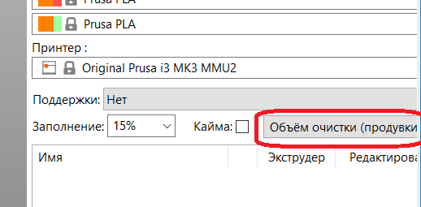

# Localization and translation guide

The purpose of this guide is to describe how to contribute to the PrusaSlicer translations. We use GNUgettext for extracting string resources from the project and PoEdit for editing translations.

Those can be downloaded here: 
-    https://sourceforge.net/directory/os:windows/?q=gnu+gettext GNUgettext package contains a set of tools to extract strings from the source code and to create the translation Catalog.
-    https://poedit.net PoEdit provides good interface for the translators.

After GNUgettext is installed, it is recommended to add the path to gettext/bin to PATH variable.

Full manual for GNUgettext can be seen here: http://www.gnu.org/software/gettext/manual/gettext.html


### Scenario 1. How do I add a translation or fix an existing translation
1. Get PO-file from corresponding folder here:
https://github.com/prusa3d/PrusaSlicer/tree/master/resources/localization
2. Open this file in PoEdit as "Edit a translation"
3. Apply your corrections to the translation
4. Push changed PrusaSlicer.po and PrusaSlicer.mo (will create automatically after saving of PrusaSlicer.po in PoEdit) into the original folder.

### Scenario 2. How do I add a new language support
1. Get file PrusaSlicer.pot here :
https://github.com/prusa3d/PrusaSlicer/tree/master/resources/localization
2. Open it in PoEdit for "Create new translation"
3. Select Translation Language (for example French).
4. As a result you will have fr.po - the file containing translation to French.
Notice. When the translation is complete you need to:
    - Rename the file to PrusaSlicer.po
    - Click "Save file" button. PrusaSlicer.mo will be created immediately
    - Both PrusaSlicer.po and PrusaSlicer.mo have to be saved here:
https://github.com/prusa3d/PrusaSlicer/tree/master/resources/localization/fr
( name of folder "fr" means "French" - the translation language). 

### Scenario 3. How do I add a new text resource when implementing a feature to PrusaSlicer
Each string resource in PrusaSlicer available for translation needs to be explicitly marked using L() macro like this:
```C++
auto msg = L("This message to be localized")
```
To get translated text use one of needed macro/function (`_(s)` or `_CHB(s)` ).
If you add new file resource, add it to the list of files containing macro `L()`

### Scenario 4. How do I use GNUgettext to localize my own application taking PrusaSlicer as an example

1.  For convenience create a list of files with this macro `L(s)`. We have 
https://github.com/prusa3d/PrusaSlicer/tree/master/resources/localization/list.txt.

2.  Create template file(*.POT) with GNUgettext command:
    ```
        xgettext --keyword=L --add-comments=TRN --from-code=UTF-8 --debug -o PrusaSlicer.pot -f list.txt
    ```

    Use flag `--from-code=UTF-8` to specify that the source strings are in UTF-8 encoding
    Use flag `--debug` to correctly extract formatted strings(used %d, %s etc.)

3.  Create PO- and MO-files for your project as described above.

4.  To merge old PO-file with strings from created new POT-file use command:
    ```
        msgmerge -N -o new.po old.po new.pot
    ```
    Use option `-N` to not using fuzzy matching when an exact match is not found.

5.  To concatenate old PO-file with strings from new PO-file use command:
    ```
        msgcat -o new.po old.po
    ```

6.  Create an English translation catalog with command:
    ```    
        msgen -o new.po old.po
    ```
    Notice, in this Catalog it will be totally same strings for initial text and translated.

When you have Catalog to translation open POT or PO file in PoEdit and start translating.


## General guidelines for PrusaSlicer translators


- We recommend using *PoEdit* application for translation (as described above). It will help you eliminate most punctuation errors and will show you strings with "random" translations (if the fuzzy parameter was used).

- To check how the translated text looks on the UI elements, test it :) If you use *PoEdit*, all you need to do is save the file. At this point, a MO file will be created. Rename it PrusaSlicer.mo, and you can run PrusaSlicer (see above).

- If you see an encoding error (garbage characters instead of Unicode) somewhere in PrusaSlicer, report it. It is likely not a problem of your translation, but a bug in the software.

- See on which UI elements the translated phrase will be used. Especially if it's a button, it is very important to decide on the translation and not write alternative translations in parentheses, as this will significantly increase the width of the button, which is sometimes highly undesirable:



- If you decide to use autocorrect or any batch processing tool, the output requires very careful proofreading. It is very easy to make it do changes that break things big time.

- **Any formatting parts of the phrases must remain unchanged.** For example, you should not change `%1%` to `%1 %`, you should not change `%%` to `%` (for percent sign) and similar. This will lead to application crashes.

- Please pay attention to spaces, line breaks (\n) and punctuation marks. **Don't add extra line breaks.** This is especially important for parameter names.

- Description of the parameters should not contain units of measurement. For example, "Enable fan if layer print time is less than ~~n seconds~~"

- For units of measurement, use the international system of units. Use "s" instead of "sec".

- If the phrase doesn't have a dot at the end, don't add it. And if it does, then don't forget to :)

- It is useful to stick to the same terminology in the application (especially with basic terms such as "filament" and similar). Stay consistent. Otherwise it will confuse users.

