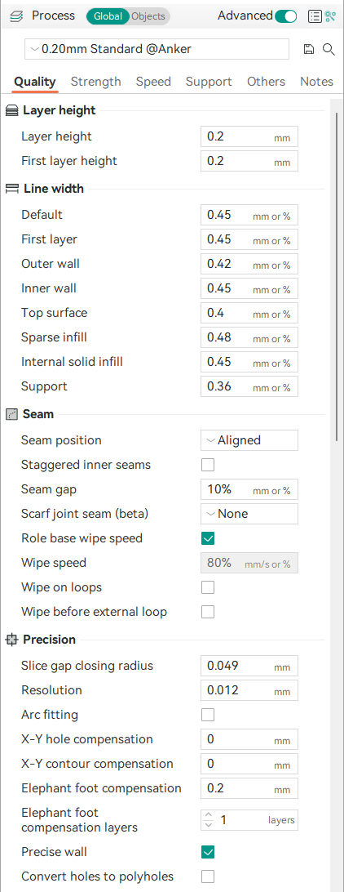
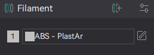
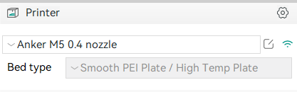

This page deals with the explanation for 3 classes in the code.

## [`Preset`](../../src/libslic3r/Preset.hpp)

As the name might suggest this class deals with presets for various things. It defines an enum `Type` which basically tells you what kind of data the present contains. Below are a few explained and there corresponding UI elements

#### Note: There is a lot of outdated and legacy code in the code base.

- `TYPE_PRINT`: Refers to a process preset. It's called 'Print' probably due to some legacy code.

- `TYPE_FILAMENT`: As the name suggests this preset is for filaments

- `TYPE_PRINTER`: Preset for printers.

There are other preset types but some of them are for SLA. Which is legacy code, since SLA printers are no longer supported. Above 3 are the important types.

## [`PresetBundle`](../../src/libslic3r/PresetBundle.hpp)

This is a bundle containing a few types of `PresetCollection`. One bundle has presets for some printers, filaments and some processes (TYPE_PRINT).

`PresetCollection            prints`\
`PresetCollection            filaments`\
`PrinterPresetCollection     printers`

each one of these contains a collection of processes, filaments and printers respectively.\

#### Note: Printers, filaments and processes in the bundle don't all have to be compatible with each other. In fact all the saved presets are stored in one `PresetBundle`. The `PresetBundle` is loaded on start up. The list of filaments and processes shown for a particular printer is a subset of `filaments` and `prints` `PresetCollection`s.

## [`PresetCollection`](../../src/libslic3r/Preset.hpp)

`PrinterPresetCollection` is a class derived from `PresetCollection`.

These contain a collection of presets. The presets could be of any type.\
functions of note here are:

`get_edited_preset()`: returns the current selected preset along with any modifications the user has made.\
`get_selected_preset()`: returns the current selected preset without the modifications the user has made.
