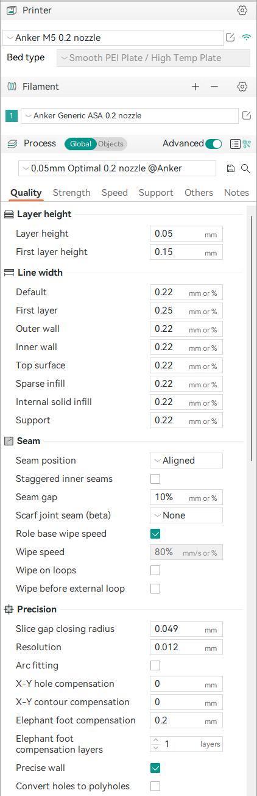
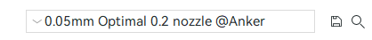
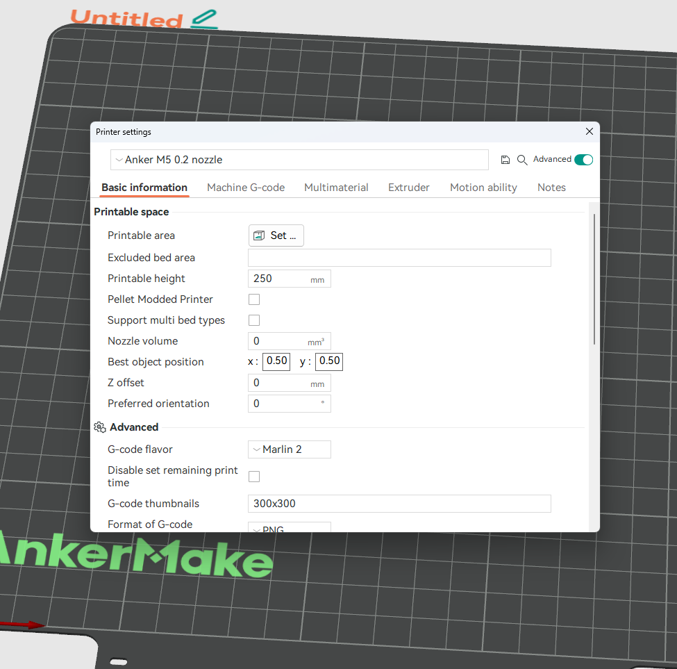

### !! incomplete, possibly inaccurate, being updated with new info !!

## [`Plater`](../../src/slic3r/GUI/Plater.hpp)

Refers to the entire application. The whole view, file loading, project saving and loading is all managed by this class. This class contains members for the model viewer, the sidebar, gcode viewer and everything else.

## [`Sidebar`](../../src/slic3r/GUI/Plater.hpp)

This is relating the the sidebar in the application window

## [`ComboBox`](../../src/slic3r/GUI/Widgets/ComboBox.hpp)

The drop down menus where you can see and select presets

## [`Tab`](../../src/slic3r/GUI/Tab.hpp)

Refers to the pop windows that open when you click the edit preset button

