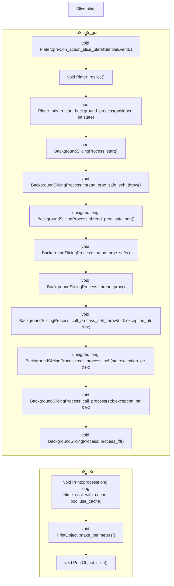

## Slicing Call Hierarchy

The Slicing logic is not the easiest to locate in the code base. Below is a flow diagram of function calls that are made after clicking the `Slice Plate` button in the UI. Most of the processing happens in different threads. Note the calls after `BackgroundSlicingProcess::start()`, but this is how you can find the slicing logic.

