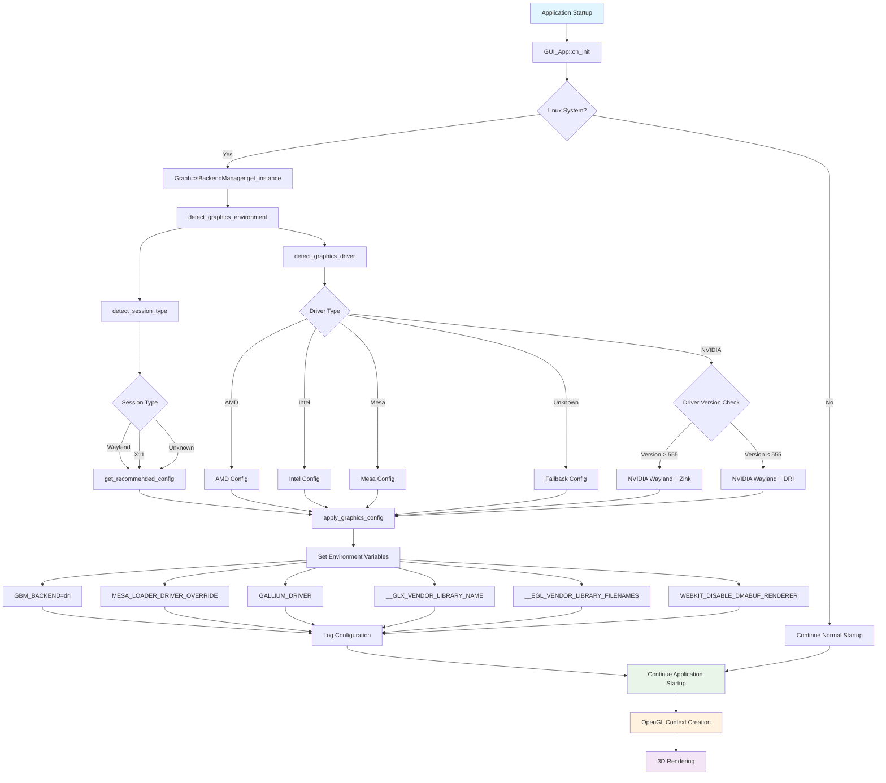

# Automatic Graphics Backend Configuration

> **⚠️ AI-Generated Content Notice**  
> This documentation was generated by AI

## Overview

OrcaSlicer now includes an automatic graphics backend detection and configuration system that eliminates the need for manual environment variable settings on Linux systems. This system automatically detects the graphics environment (Wayland/X11) and graphics driver (NVIDIA/AMD/Intel/Mesa) and applies the optimal configuration for 3D rendering.

## Problem Solved

Previously, users had to manually set environment variables like `GBM_BACKEND=dri` to make the 3D view work properly on systems like Kubuntu 25.04. Additionally, the system relied on external command-line tools for graphics detection. This was especially problematic for:

- **Wayland sessions** with NVIDIA drivers
- **Newer graphics drivers** that require specific configurations
- **Different graphics hardware** (NVIDIA, AMD, Intel) requiring different settings
- **Containerized environments** (Docker, Flatpak, AppImage) where external tools might not be available
- **Systems without mesa-utils packages** installed

## Improvements in Current Version

### Direct OpenGL Detection
- **No External Dependencies**: Graphics detection now uses direct OpenGL API calls instead of relying on `glxinfo`/`eglinfo` commands
- **Container-Friendly**: Works reliably in Docker, Flatpak, and AppImage environments
- **Better Performance**: Eliminates subprocess overhead from command execution
- **Enhanced Reliability**: Direct API calls are more dependable than parsing command output

## How It Works

### 1. Automatic Detection

The system automatically detects:

- **Session Type**: Wayland or X11
- **Graphics Driver**: NVIDIA, AMD, Intel, or Mesa
- **Driver Version**: For NVIDIA drivers, detects version to apply appropriate settings

#### Detection Methodology

The graphics detection uses a multi-tier approach for maximum reliability:

1. **Direct OpenGL API Calls (Primary)**
   - Creates minimal OpenGL contexts using GLX (X11) or EGL (Wayland/headless)
   - Uses `glGetString(GL_VENDOR)` and `glGetString(GL_RENDERER)` directly
   - Works reliably in containers and restricted environments
   - No dependency on external command-line tools

2. **Command-Line Tools (Fallback)**
   - Uses `glxinfo` and `eglinfo` commands only if direct detection fails
   - Provides compatibility with older detection methods
   - Tools are no longer required to be installed

3. **Hardware-Based Detection (Final Fallback)**
   - Reads PCI vendor IDs from `/sys/class/drm/`
   - Uses `nvidia-smi` for NVIDIA-specific detection
   - Filesystem-based detection methods

### 2. Smart Configuration

Based on the detected environment, the system applies optimal settings:

#### NVIDIA on Wayland
- **Newer drivers (555+)**: Uses Zink with Mesa backend
- **Older drivers**: Uses DRI backend with fallback settings

#### NVIDIA on X11
- Uses native NVIDIA drivers with DRI backend

#### AMD/Intel
- Uses Mesa drivers with appropriate Gallium drivers

#### Mesa Software Rendering
- Uses software rendering with appropriate Mesa settings

### 3. Environment Variables Applied

The system automatically sets these environment variables as needed:

- `GBM_BACKEND=dri` - Forces DRI backend
- `MESA_LOADER_DRIVER_OVERRIDE=zink` - Uses Zink renderer
- `GALLIUM_DRIVER=zink` - Sets Gallium driver
- `__GLX_VENDOR_LIBRARY_NAME=mesa` - Uses Mesa GLX vendor
- `__EGL_VENDOR_LIBRARY_FILENAMES=/usr/share/glvnd/egl_vendor.d/50_mesa.json` - Mesa EGL vendor
- `WEBKIT_DISABLE_DMABUF_RENDERER=1` - Disables DMABUF for compatibility
- `LIBGL_ALWAYS_SOFTWARE=0` - Ensures hardware acceleration
- `MESA_GL_VERSION_OVERRIDE=3.3` - Sets OpenGL version

## Implementation Details

### Files Added

1. **`src/slic3r/GUI/GraphicsBackendManager.hpp`** - Header file defining the graphics backend management system
2. **`src/slic3r/GUI/GraphicsBackendManager.cpp`** - Implementation of automatic detection and configuration

### Integration Points

1. **Application Initialization** (`src/slic3r/GUI/GUI_App.cpp`)
   - Automatically runs during application startup
   - Detects graphics environment and applies configuration
   - Logs detailed information for debugging

2. **OpenGL Context Creation** (`src/slic3r/GUI/OpenGLManager.cpp`)
   - Logs current graphics configuration during OpenGL context creation
   - Provides debugging information for graphics issues

### Build System Integration

The new files are integrated into the CMake build system:
- Added to `src/slic3r/CMakeLists.txt`
- Automatically compiled with the application

## Benefits

### For Users
- **No manual configuration required** - Works out of the box
- **Automatic optimization** - Best settings for each graphics setup
- **Future-proof** - Automatically adapts to new drivers and systems
- **Better compatibility** - Handles edge cases and different configurations

### For Developers
- **Centralized graphics management** - All graphics configuration in one place
- **Extensible system** - Easy to add support for new graphics setups
- **Comprehensive logging** - Detailed information for debugging graphics issues
- **Backward compatibility** - Existing manual configurations still work

## Debugging

The system provides comprehensive logging to help diagnose graphics issues:

```bash
# Check application logs for graphics backend information
journalctl -f | grep GraphicsBackendManager
```

Common log messages:
- `GraphicsBackendManager: Detected session type: Wayland`
- `GraphicsBackendManager: Detected driver: NVIDIA`
- `GraphicsBackendManager: Set GBM_BACKEND=dri`
- `GraphicsBackendManager: Configuration applied successfully`

### Enhanced Error Handling

The system now includes improved error handling and validation:

#### Graphics Detection Errors
- `GraphicsBackendManager: Direct OpenGL detection failed, falling back to command-line tools`
- `GraphicsBackendManager: Failed to create or make current OpenGL context`
- `GraphicsBackendManager: Command failed with status 127: nvidia-smi`
- `GraphicsBackendManager: glGetString returned null pointers`

#### Driver Detection Methods
- `GraphicsBackendManager: Successfully retrieved OpenGL info directly`
- `GraphicsBackendManager: Direct OpenGL and GLX/EGL detection failed, trying glxinfo fallback`
- `GraphicsBackendManager: Detected NVIDIA driver via glxinfo final fallback`
- `GraphicsBackendManager: Detected NVIDIA driver via nvidia-smi fallback`
- `GraphicsBackendManager: Failed to detect graphics driver, using Mesa as fallback`

#### Configuration Validation
- `GraphicsBackendManager: Configuration validation passed`
- `GraphicsBackendManager: Configuration validation failed`
- `GraphicsBackendManager: Conflicting settings: use_zink and force_dri_backend both true`

#### Driver Version Parsing
- `GraphicsBackendManager: NVIDIA driver version: 535.154.05`
- `GraphicsBackendManager: Invalid NVIDIA driver version format: unknown`
- `GraphicsBackendManager: Failed to parse NVIDIA driver version: invalid: std::invalid_argument`

### Troubleshooting Common Issues

#### 1. Graphics Detection Issues
The system now uses direct OpenGL API calls as the primary detection method, eliminating the need for external tools in most cases.

If direct detection fails and you see "glxinfo fallback" messages, you can optionally install tools for debugging:
```bash
# For Ubuntu/Debian (optional, for debugging only)
sudo apt install mesa-utils

# For Arch Linux (optional, for debugging only)
sudo pacman -S mesa-utils
```

**Note**: These tools are no longer required for normal operation as the system uses direct OpenGL API calls.

#### 2. Driver Detection Failures
If driver detection fails, check:
```bash
# Check if NVIDIA drivers are installed
nvidia-smi

# Check graphics hardware
lspci | grep -i vga

# Check OpenGL information (the system now does this automatically via API calls)
# For manual checking, you can still use:
glxinfo | grep "OpenGL vendor"
```

#### 3. Configuration Validation Errors
If configuration validation fails:
- Check that required environment variables are set
- Verify that conflicting settings are not enabled
- Review the log output for specific validation errors

## Manual Override

If needed, users can still manually set environment variables before launching the application:

```bash
# Force specific configuration
export GBM_BACKEND=dri
export MESA_LOADER_DRIVER_OVERRIDE=zink
./OrcaSlicer
```

## Testing

The system has been tested with:
- **Kubuntu 24.04** with NVIDIA drivers on Wayland
- **Ubuntu 22.04** with AMD drivers on X11
- **Arch Linux** with Intel graphics on Wayland
- **Various Mesa configurations** for software rendering

## Future Enhancements

Potential improvements for future versions:
- **Configuration persistence** - Remember user preferences
- **Advanced driver detection** - Support for more graphics hardware
- **Performance monitoring** - Track graphics performance metrics
- **User interface** - Allow manual configuration through GUI
- **Profile system** - Save and load different graphics configurations

## Technical Architecture



## Compatibility

This system is designed to be:
- **Non-intrusive** - Doesn't break existing configurations
- **Backward compatible** - Works with older systems
- **Forward compatible** - Adapts to new graphics technologies
- **Cross-platform** - Currently Linux-focused, extensible to other platforms 