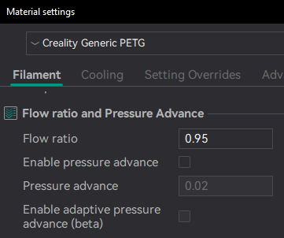

# Flow rate

The Flow Ratio determines how much filament is extruded and plays a key role in achieving high-quality prints. A properly calibrated flow ratio ensures consistent layer adhesion and accurate dimensions. If the flow ratio is too low, under-extrusion may occur, leading to gaps, weak layers, and poor structural integrity. On the other hand, a flow ratio that is too high can cause over-extrusion, resulting in excess material, rough surfaces, and dimensional inaccuracies.

> [!WARNING]
> For Bambulab X1/X1C users, make sure you do not select the 'Flow calibration' option.

> 

> [!IMPORTANT]
> PASS 1 and PASS 2 follow the older flow ratio formula `FlowRatio_old*(100 + modifier)/100`. YOLO (Recommended) and YOLO (perfectist version) use a new system that is very simple `FlowRatio_old±modifier`.

Calibrating the flow rate involves a two-step process.

1. Select the printer, filament, and process you would like to use for the test.
2. Select `Pass 1` in the `Calibration` menu
3. A new project consisting of nine blocks will be created, each with a different flow rate modifier. Slice and print the project.
4. Examine the blocks and determine which one has the smoothest top surface.
   
   

5. Update the flow ratio in the filament settings using the following equation: `FlowRatio_old*(100 + modifier)/100`. If your previous flow ratio was `0.98` and you selected the block with a flow rate modifier of `+5`, the new value should be calculated as follows: `0.98x(100+5)/100 = 1.029`.** Remember** to save the filament profile.
6. Perform the `Pass 2` calibration. This process is similar to `Pass 1`, but a new project with ten blocks will be generated. The flow rate modifiers for this project will range from `-9 to 0`.
7. Repeat steps 4. and 5. In this case, if your previous flow ratio was 1.029 and you selected the block with a flow rate modifier of -6, the new value should be calculated as follows: `1.029x(100-6)/100 = 0.96726`. **Remember** to save the filament profile.

> [!TIP]
> @ItsDeidara has made a html to help with the calculation. Check it out if those equations give you a headache [here](https://github.com/ItsDeidara/Orca-Slicer-Assistant).