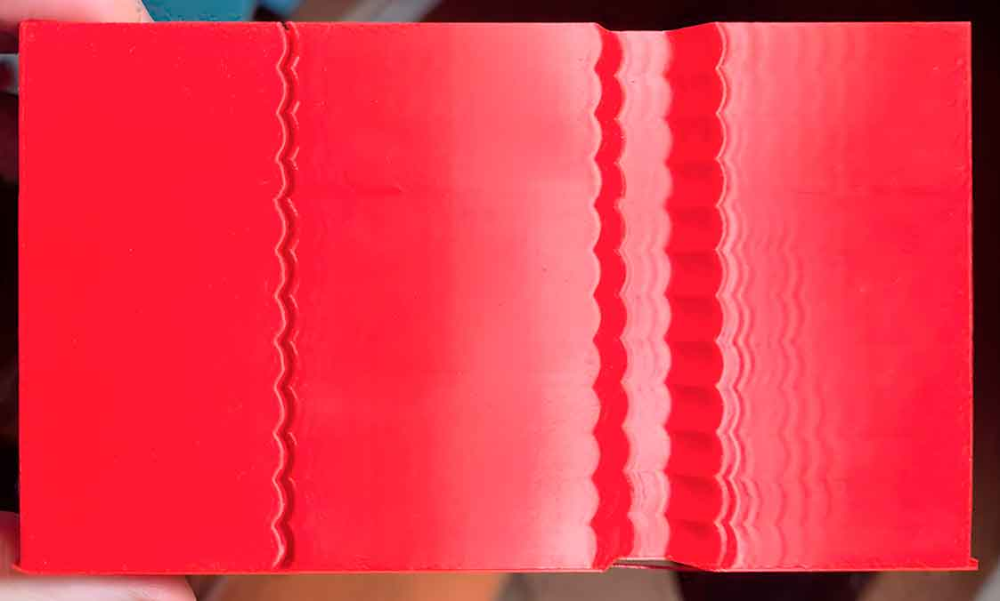
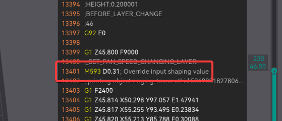

# Input Shaping

During high-speed movements, vibrations can cause a phenomenon called "ringing," where periodic ripples appear on the print surface. Input Shaping provides an effective solution by counteracting these vibrations, improving print quality and reducing wear on components without needing to significantly lower print speeds.

- [Klipper](#klipper)
- [Marlin](#marlin)


## Klipper

### Resonance Compensation

The Klipper Resonance Compensation is a set of Input Shaping modes that can be used to reduce ringing and improve print quality.
Ussualy the recommended values modes are ``MZV`` or ``EI`` for Delta printers.

1. Pre-requisites:
   1. In OrcaSlicer, set:
      1. Acceleration high enough to trigger ringing (e.g., 2000 mm/s²).
      2. Speed high enough to trigger ringing (e.g., 100 mm/s).
      3. Jerk [Klipper Square Corner Velocity](https://www.klipper3d.org/Kinematics.html?h=square+corner+velocity#look-ahead) to 5 or a high value (e.g., 20).
   2. In printer settigs:
      1. Set the Shaper Type to ``MZV`` or ``EI``.
         ```
         SET_INPUT_SHAPER SHAPER_TYPE=MZV
         ```  
      2. Disable [Minimun Cruise Ratio](https://www.klipper3d.org/Kinematics.html#minimum-cruise-ratio) with:
            ```
            SET_VELOCITY_LIMIT MINIMUM_CRUISE_RATIO=0
            ```
   3. Use an opaque, high-gloss filament to make the ringing more visible.
2. Print the Input Shaping Frequency test with a range of frequencies.

   

   1. Measure the X and Y heights and read the frequency set at that point in Orca Slicer.

   
   

   2. If not a clear result, you can measure a X and Y min and max acceptable heights and repeat the test with that min and max value.
   
   **Note**: There is a chance you will need to set higher than 60Hz frequencies. Some printers with very rigid frames and excellent mechanics may exhibit frequencies exceeding 100Hz.
3. Print the Damping test setting your X and Y frequency to the value you found in the previous step.

   

   1. Measure the X and Y heights and read the damping set at that point in Orca Slicer.
   
   
   

   **Note**: Not all Resonance Compensation modes support damping
4. Restore your 3D Printer settings to avoid keep using high acceleration and jerk values.
5. Save the settings
   1. You need to go to the printer settings and set the X and Y frequency and damp to the value you found in the previous step.

## Marlin

### ZV Input Shaping

ZV Input Shaping introduces an anti-vibration signal into the stepper motion for the X and Y axes. It works by splitting the step count into two halves: the first at half the frequency and the second as an "echo," delayed by half the ringing interval. This simple approach effectively reduces vibrations, improving print quality and allowing for higher speeds.

1. Pre-requisites:
   1. In OrcaSlicer, set:
      1. Acceleration high enough to trigger ringing (e.g., 2000 mm/s²).
      2. Speed high enough to trigger ringing (e.g., 100 mm/s).
      3. Jerk
         1. If using [Classic Jerk](https://marlinfw.org/docs/configuration/configuration.html#jerk-) use a high value (e.g., 20).
         2. If using [Junction Deviation](https://marlinfw.org/docs/features/junction_deviation.html) (new Marlin default mode) this test will use 0.25 (high enough to most printers).
   2. Use an opaque, high-gloss filament to make the ringing more visible.
2. Print the Input Shaping Frequency test with a range of frequencies. 

   

   1. Measure the X and Y heights and read the frequency set at that point in Orca Slicer.

   
   

   2. If not a clear result, you can measure a X and Y min and max acceptable heights and repeat the test with that min and max value.
   
   **Note**: There is a chance you will need to set higher than 60Hz frequencies. Some printers with very rigid frames and excellent mechanics may exhibit frequencies exceeding 100Hz.
3. Print the Damping test setting your X and Y frequency to the value you found in the previous step.

   

   1. Measure the X and Y heights and read the damping set at that point in Orca Slicer.

   
   

4. Restore your 3D Printer settings to avoid keep using high acceleration and jerk values.
   1. Reboot your printer.
   2. Use the following G-code to restore your printer settings:
   ```gcode
   M501
   ```
5. Save the settings
   1. You need to go to the printer settings and set the X and Y frequency and damp to the value you found in the previous step.
   2. Use the following G-code to set the frequency:
   ```gcode
   M593 X F#Xfrequency D#XDamping
   M593 Y F#Yfrequency D#YDamping
   M500
   ```
   Example
   ```gcode
   M593 X F37.25 D0.16
   M593 Y F37.5 D0.06
   M500
   ```

### Fixed-Time Motion

TODO This calibration test is currently under development. See the [Marlin documentation](https://marlinfw.org/docs/gcode/M493.html) for more information.