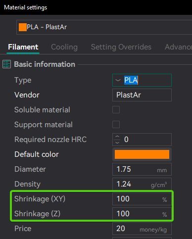
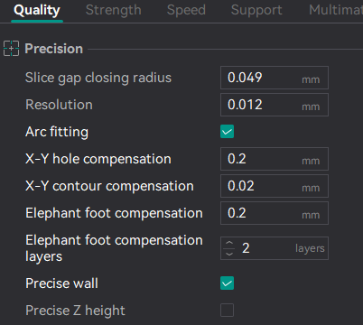
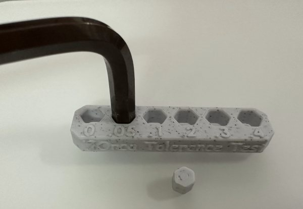

# Filament Tolerance Calibration

Each filament and printer combination can result in different tolerances. This means that even using the same filament and print profile, tolerances may vary from one printer to another.
To correct for these variations, Orca Slicer provides:

- Filament Compensation:

  - Shrinkage (XY)

    

- Process Compensation:

  - X-Y hole compensation
  - X-Y contour compensation
  - Precise wall
  - Precise Z height

    

## Orca Tolerance Test

This calibration test is designed to evaluate the dimensional accuracy of your printer and filament. The model consists of a base with six hexagonal holes, each with a different tolerance: 0.0 mm, 0.05 mm, 0.1 mm, 0.2 mm, 0.3 mm, and 0.4 mm, as well as a hexagon-shaped tester.

You can check the tolerance using either an M6 Allen key or the included printed hexagon tester.
Use calipers to measure both the holes and the inner tester. Based on your results, you can fine-tune the X-Y hole compensation and X-Y contour compensation settings. Repeat the process until you achieve the desired precision.

