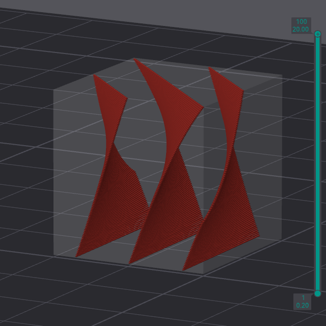
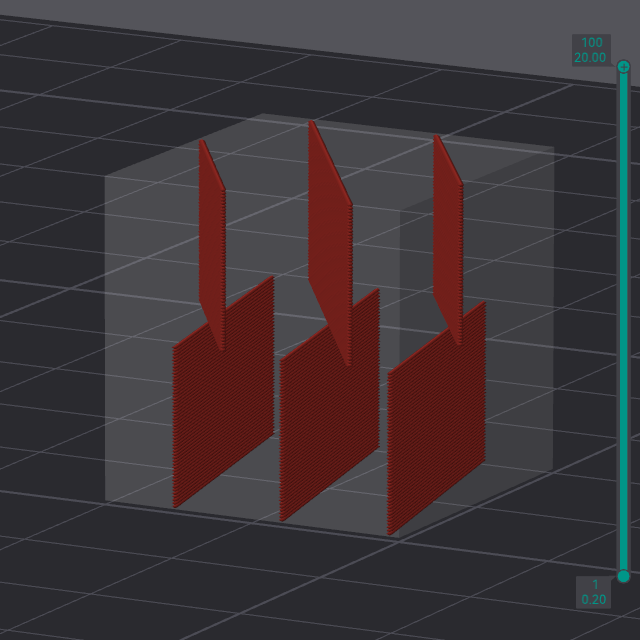
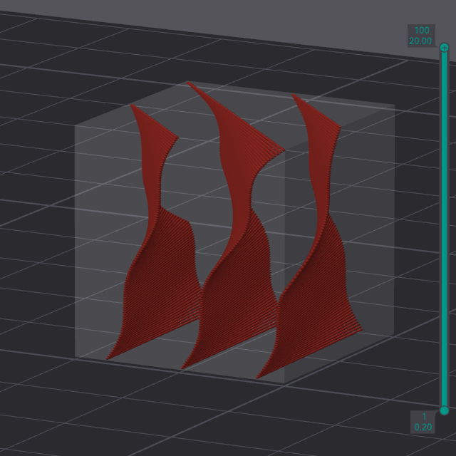
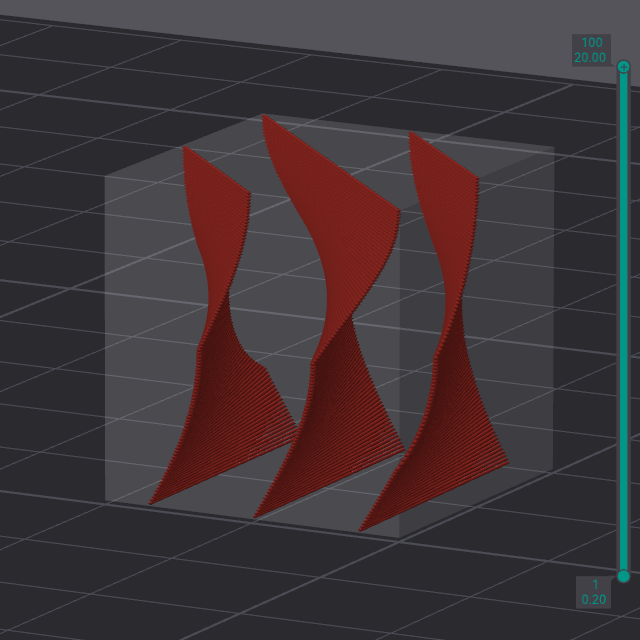
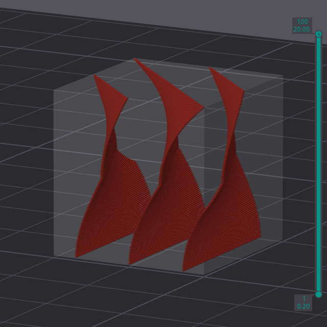
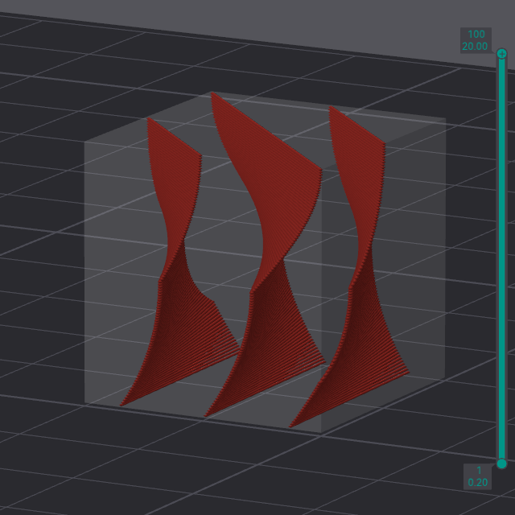
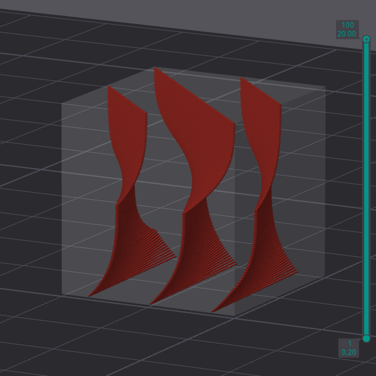
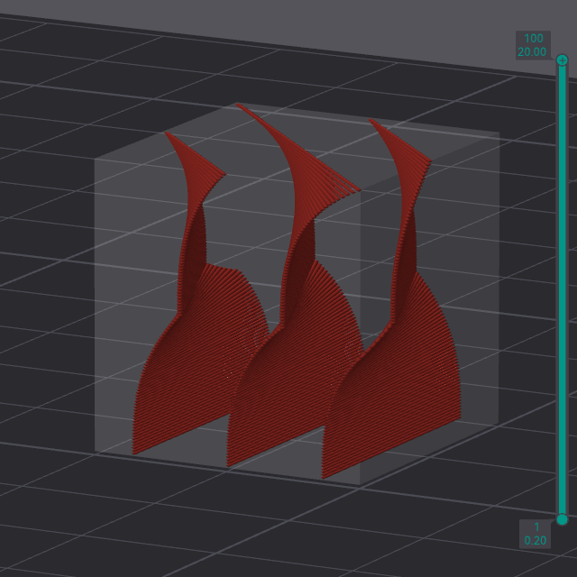

# Template metalanguage

## Basic instructions

`[±]α[*ℤ or !][solid or joint sign, оr its combinations][-][ℕ, B or T][length modifier][* or !]`  - full length template instruction for the **sparse** infill 

`[±]α[*ℤ or !][joint sign][-][ℕ][* or !]` - full length template instruction for the **solid** infill 

`[±]α*` - just setting an initial rotation angle 

`[solid or joint sign]ℕ[!]` - putting the solid layers ℕ times without them rotating 

`[B or T][!]` - putting the solid layers according to the number of bottom or top shell layers without them rotating 

> `[...]` - values in square brackets are optional

### Defined angle
`[±]α` - command of setting of rotation infill angle (for joint infills at some height range, this angle is finite): 
   - `α` - just set absolute angle 0...360 
   - `+α` - set positive relative angle CCW 
   - `-α` - set negative relative angle CW 

### Runtime instructions
`[*, *ℤ or !]` - runtime instructions: 
   - `*` - the mark of "dumb" instruction. Its need for setting an initial angle. No further action will be taken 
   - `*ℤ` - repeat the instruction ℤ times 
   - `!` - the one-time running instruction 

### Solid sign
`[solid sign]` - the mark for insert solid layer: 
   - `D` - insert native sparse patterned layer but with 100% density 
   - `S` - insert user-defined solid layer 
   - `O` - insert Concentric solid layer 
   - `M` - insert Monotonic solid layer 
   - `R` - insert Rectilinear solid layer 

### Joint sign
`[joint sign]` - the symbol which determinate method of connection for turning of the infill: 

   - `/` - linear displacement of the infill 
    `+22.5/50%`

   - `#` - infill of multiple layers with vertical displacement at finish angle 
    `+22.5#50%`

   - `#-` - infill of multiple layers with vertical displacement at initial angle 
    `+22.5#-50%`

   - `|` - infill of multiple layers with vertical displacement at middle angle 
    `+22.5|50%`

   - `N` - infill form by sinus function (vertical connection) 
    `+22.5N50%`

   - `n` - infill form by sinus function (vertical connection, lazy) 
    `+22.5n50%`

   - `Z` - infill form by sinus function (horizontal connection) 
    `+22.5Z50%`

   - `z` - infill form by sinus function (horizontal connection, lazy) 
    `+22.5z50%`

   - `L` - infill form by quarter of circle  (horizontal to vertical connection) 
    `+22.5L50%`

   - `l` -  infill form by quarter of circle (vertical to horizontal connection) 
    `+22.5l50%`

   - `U` - infill form by squared function 
    `+22.5U50%`

   - `u-` - infill form by squared function (inverse) 
    `+22.5u-50%`

   - `Q` - infill form by cubic function 
    `+22.5Q50%`

   - `q-` - infill form by cubic function (inverse) 
    `+22.5q-50%`

   - `$` - infill form by arcsinus method 
    `+22.5$50%`

   - `~` - infill form random angle 
    `+22.5~50%`

   - `^` - infill form pseudorandom angle 
    `+22.5^50%`

### Counting 
`[-]ℕ` - counting the distance at which the turn will take place: 
   - `ℕ` - the count will take place by ℕ layers 
    `+22.5/50%`

   - `-ℕ` - indicates that the joint form will be flipped upward 
    `+22.5/-50%`

   - `B` - the count will take place by next layers equals of bottom_shell_layers parameter 
   - `T` - the count will take place by next layers equals of top_shell_layers parameter 

### Length modifier
`ℕ[length modifier]` - the distance at which the specified turn will take place: 
   - `ℕmm` - the distance in millimeters 
   - `ℕcm` - the distance in centimeters 
   - `ℕm` - the distance in meters 
   - `ℕ'` - the distance in feet 
   - `ℕ"` - the distance in inches 
   - `ℕ#` - the distance in range of standard height of ℕ layers 
   - `ℕ%` - the distance of model height in percents 

## Description of instructions and examples
Each instruction is written by combination of symbols and numbers and separated by a comma or a space.
For more complex instructions, an autoformat is used to make the template easier to read.
All examples are shown with a 5% density rectilinear infill on model of cube 20x20x20mm which has 100 layers of 0.2mm thickness. Without walls and upper and lower shells. Initial angle is 0. 

### Simple absolute instructions
They include a simple definition of the angle for each layer. Note that the initial setting of this angle is also affected by the value in the sparse or solid infill angle field.

`0`, `15`, `45.5`, `256.5605`... - just fill at the existing angle. The initial direction starts at the X-axis one, and the acceptable range of values is from 0 to 360 

 `0` as also `+0`, `-0` or just empty template 

 `45` 

`0%`, `10%`, `25%`, `100%`... - infill angle determine from relative terms from a full turn of 360 degree rotation. Rotate by 0, 36, 90, and 0 degrees. 

 `25%` - the equivalent of `90` instruction. 

 `0, 30` - is a simple alternation through each layer in the direction of 0 and 30 degrees. 

`30, 60, 90, 120, 150, 0` - a more complex command defines a turn every layer at 30 degrees. At the end of the template line, the next instruction is read first, and this process continues until the entire height of the model is filled in.

### Relative instructions
`+30` - this is a short instruction by counterclockwise rotation. The equivalent of `30, 60, 90, 120, 150, 180, 210, 240, 270, 300, 330, 0` or `30, 60, 90, 120, 150, 0` instruction. 
 

`-30` - this is the same instruction, but with clockwise rotation. The equivalent of `330, 300, 270, 240, 210, 180, 150, 120, 90, 60, 30, 0` or `330, 300, 270, 240, 210, 0` instruction. 

`+150` - you can specify a different multiple of the irrational angle for better fill dispersion = `150, 300, 90, 240, 30, 180, 330, 120, 270, 60, 210, 0` ... 

`+45` The equivalent of `45, 90, 135, 180, 225, 270, 315, 0` or `45, 90, 135, 0` instruction. 
 

`+90` The equivalent of `90, 180, 270, 0` or `90, 0` instruction. 
 

`+15%` -  useful for dividing angles on a decimal basis = `54, 108, 162, 270, 324, 18, 72, 126, 180, 234, 288, 342, 36, 90, 144, 196, 252, 306, 0` ... 

`+30, +90` - a complex instruction setting the rotation of each layer in these positions = `30, 120, 150, 240, 270, 0` ... 
 

`0, +30, +90` - a complex instruction setting the rotation of each layer in these positions = `0, 30, 120` ... 
 

### Repetitive, adjusting and one-time instructions
`5, 10, +20` - simple instructions without modifiers. Sets the angles in sequence = 5, 10, 30, 5, 10, 30, 5, 10 ... 

`5, 10*, +20` - the `*` sign sets the initial angle without quantitative designation without the layer processing. It is useful for setting the orientation of a group of layers, which will be described below. Sets the angles in sequence = 5, 30, 5, 30, 5, 30, 5 ... 

`5, 10!, +20` - the `!` sign indicates that instruction will be executed only once for the entire height of the model. Sets the angles in sequence = 5, 10, 30, 5, 25, 5, 25, 5  ... 

`5, 10*!, +20` - the combination `*` and `!` signs also usable = 5, 30, 5, 25, 5, 25, 5, 25 ... 

`5, 10*3, +20` - if a number is written after the `*` sign, it indicates the number of repetitions of this instruction. Sets the angles in sequence = 5, 10, 10, 10, 30, 5, 10, 10, 10, 30, 5, 10 ... 

### Range instructions
A combined set of layers will be organized, where the rotation of one layer relative to the other will also be predetermined.
You can specify how many layers will be rotated by a certain angle, and according to which mathematical law this rotation will be performed. This law is determined by writing a certain symbol and specifying a numeric value after it. 
The following signs are available that determine the shape of the turn: `/` `#` `#-` `|` `N` `n` `Z` `z` `L` `l` `U` `u` `Q` `q` `$` `~` `^`. For their purpose, see [above](###Joint-sign).

Also, after the digital value there is a range modifier, then this rotation will occur according to the described length. 
The following modifiers are available that determine the range of turn: `mm` `cm` `m` `'` `"` `#` `%`. For their purpose, see [above](###Length-modifier).

If there is the `-` sign before the numeric value, then the initial fill angle changes with the final one. This is useful for joining the linear infills in some cases. Absolute values of the rotation angle using the range instructions have no effect.
It is important to know that this will not be the exact length, but will be tied to the nearest layer from below.

`+45/100` - rotate the next 100 layers linearly at a 45 degree angle. For this model, this instruction is equivalent of `+45/100%` as it contains 100 layers. 
 

When changing the height of the instruction `+45/50` or `+45/50%` - the final angle will be 90, as the turn will occur twice. 
 

`-50%Z1cm` - rotate one centimeter of infill by sinus function at a 180 degree CW. 

### Constant layer number instructions
There are 2 letter signs `T` and `B` that can determine the number of shell layers on top and bottom of model. It is useful for calculating skipping this amount to align the fill, or inserting the required number of horizontal solid bulkheads.

`B!, +30` - skip the first shell layers from rotate, then fill with 30 degrees turn each layer 

`+30/1cm, T` -  rotate one centimeter of infill linearity at a 30 degree, then skip the number of layers equal to the count of the upper shell layers without rotation. 

### Solid layers into sparse infill instructions
The following instructions allow you to embed solid layers in a sparse fill. The following commands are available `D` `S` `O` `M` `R`. For their purpose, see [above](###Solid-sign). 

It is possible to combine them with the rotation method and layer number constant - `DT` `S/` `M#` `OB`... 

`#14, +15R` -  put the 14 layers of sparse infill when put one rectilinear layer of solid infill with 15 degree turn 
 

`B!, 240M3, #25` - skip the first shell layers from rotate, fill model by 3 solid monotonic layers at 240 degree, then put 25 sparse layers by same angle 

`+30/1cm, ST` -  rotate one centimeter of infill linearity at 30 degree, then put solid layers equal to the count of the top shell layers 

`+30M3` or `+90M/3` -  fill whole model by solid infill with 30 degree turn at each layer 

## Complex template examples
`+10L25%, -10l25%, -10L25%, +10l25%` -  fill the model with sine period with 10 degrees amplitude 
 

`+30/-10#` - rotate the infill at height of 10 standard layers (or @ standard layer height is 0.2mm x 10 = 2mm) inverse linearly at a 30 degree angle. 
 

`+360~100%` or `+100%~100%` - fill the model an infill with random direction at each layer. 
 
