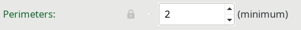
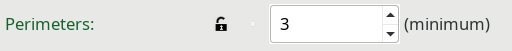
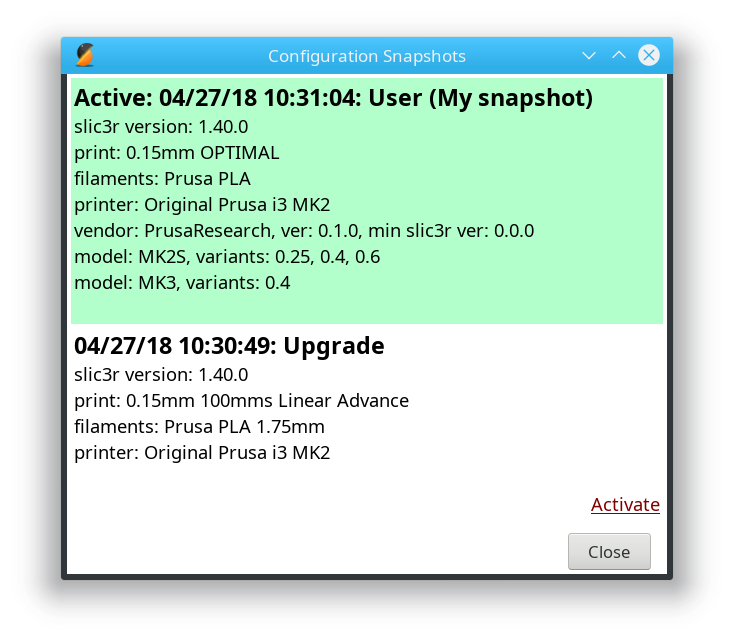

# Slic3r PE 1.40 configuration update

Slic3r PE 1.40.0 comes with a major re-work of the way configuration presets work.
There are three new features:

+ A two-tier system of presets being divided into _System_ and _User_ groups
+ Configuration snapshots
+ Configuration updating from the internet

## System and User presets

- _System preset_: These are the presets that come with Slic3r PE installation. They come from a vendor configuration bundle (not individual files like before). They are **read-only** – a user cannot modify them, but may instead create a derived User preset based on a System preset
- _User preset_: These are regular presets stored in files just like before. Additionally, they may be derived (inherited) from one of the System presets

A derived User preset keeps track of wich settings are inherited from the parent System preset and which are modified by the user. When a system preset is updated (either via installation of a new Slic3r or automatically from the internet), in a User preset the settings that are modified by the user will stay that way, while the ones that are inherited reflect the updated System preset.

This system ensures that we don't overwrite user's settings when there is an update to the built in presets.

Slic3r GUI now displays accurately which settings are inherited and which are modified.
A setting derived from a System preset is represented by green label and a locked lock icon:

A settings modified in a User preset has an open lock icon:

Clickign the open lock icon restored the system setting.

Additionaly, any setting that is modified but not yet saved onto disk is represented by orange label and a back-arrow:

Clicking the back-arrow restores the value that was previously saved in this Preset.

## Configuration snapshots

Configuration snapshots can now be taken via the _Configuration_ menu.
A snapshot contains complete configuration from the point when the snapshot was taken.
Users may move back and forth between snapshots at will using a dialog:

# Updating from the internet

Slic3r PE 1.40.0 checks for updates of the built-in System presets and downloads them.
The first-time configuration assistant will ask you if you want to enable this feature - it is **not** mandatory.

Updates are checked for and downloaded in the background. If there's is an update, Slic3r will prompt about it 
next time it is launched, never during normal program operation. An update may be either accepted or refused.
Before any update is applied a configuration snapshot (as described above) is taken.
